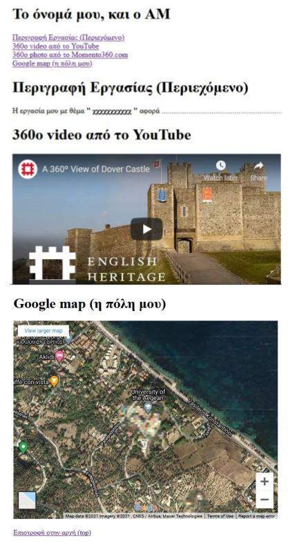

[](https://hits.seeyoufarm.com)

# Εργασία Ενδιάμεσης Εξέτασης

## Ανάπτυξη ιστοσελίδας με χρήση HTML

### Περιγραφή

Δημιουργείστε ιστοσελίδα με πολιτιστικό περιεχόμενο ενσωματώνοντας με iFrame

α) Βίντεο από το YouTube (360ο ή απλό),  
β) 360ο φωτογραφία από το Momento360.com (δική σας ή άλλη)
γ) Χάρτη της Google (με τοποθεσία σχετική με το θέμα/περιεχόμενο)
Στην αρχή της σελίδας να υπάρχει μενού με τις εξής επιλογές:

```none
Περιγραφή  
360o video από το YouTube  
360o photo από το Momento360.com 
Google map (η πόλη μου)  
```

Κάθε επιλογή να συνδέεται με αντίστοιχο σημείο της σελίδας που εμφανίζεται το περιεχόμενο.

Στο κάτω μέρος της σελίδας να υπάρχει υπερσύνδεσμος που συνδέεται με την αρχή (πάνω μέρος) της σελίδας (top).

Στον τίτλο της σελίδας (`<title>`) να αναφέρει «Πρόοδος 2021, Τεχνολογίες Διαδικτύου».

Με επικεφαλίδα `<h1>` στην αρχή της σελίδας να αναφέρει το όνομά σας και τον ΑΜ.

### Βαθμολόγηση

- Μενού επιλογών: **3**
- Ενσωμάτωση video από το ΥοuTube: **2**
- Ενσωμάτωση εικόνας από το Momento360.com: **2**
- Ενσωμάτωση χάρτη από Google maps: **2**
- Σύνδεση υποσέλιδου (footer) με την αρχή της σελίδας (top): **1**

### Παραδοτέα

Στο eClass, θα υποβληθεί .html ή .zip αρχείο της μορφής **«επίθετο.html»** ή **«επίθετο.zip»**.

### Ενδεικτική υλοποίηση



Για να δείτε τη **ΛΥΣΗ** πατήστε [εδώ](KAZH.html).
