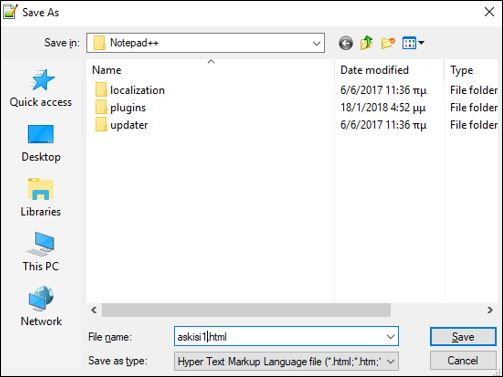
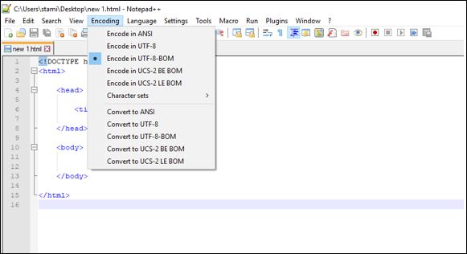

# Εργαστήριο 1

## HTML5 - Εργαλεία

- Επεξεργαστής κειμένου:
  - **TextEdit** για Macs, **Notepad** για Windows
- Και ακόμη καλύτερα:
  - **TextWrangler** για Macs, **Notepad++** για Windows
- Online π.χ. [W3schools](www.w3schools.com)
- [BlueGriffon](bluegriffon.org)
- Web browser (Firefox/Microsoft Edge/Internet Explorer/Chrome/Safari)

## Notepad++ (save as type)

## Notepad++ (encoding)

## W3schools tutorial

- [HTML](http://www.w3schools.com/html)
- [CSS](http://www.w3schools.com/html/html_css.asp)
