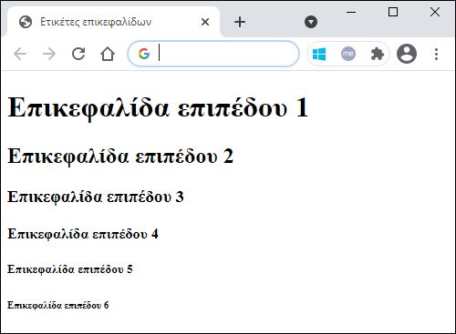

[](https://hits.seeyoufarm.com)

# Εργαστήριο 2

## Άσκηση 1

Ανοίξτε τον επεξεργαστή κειμένου Notepad και δημιουργήστε ένα HTML αρχείο το οποίο όταν ανοίξετε σε browser θα εμφανίζει το ακόλουθο αποτέλεσμα:


**ΛΥΣΗ ΑΣΚΗΣΗΣ 1**

```html
<html>
    <head>
        <title>Τίτλος πρώτης σελίδας!</title>
    </head>
    <body>
        Αυτά είναι τα περιεχόμενα της πρώτης μου ιστοσελίδας.....
    </body>
</html>
```

## Άσκηση 2

- Στο αρχείο της άσκησης 1 προσθέστε στην πρώτη γραμμή μία γραμμή κώδικα που να δηλώνει ότι πρόκειται για κώδικα γραμμένο σε HTML 5.
- Στο τμήμα `<HEAD>` του κώδικα προσθέστε το σχόλιο:
  - `<!-- Το head περιέχει πληροφορίες που αφορούν το αρχείο και δεν εμφανίζονται στην οθόνη. -->`
- Στο τμήμα `<BODY>` του κώδικα προσθέστε το σχόλιο:
  - `<!-- Γραμμένο από το φοιτητή .........., στις 9 Μαρτίου 2017 -->`
- Ανοίξετε εκ νέου το αρχείο στον browser (ή κάνετε refresh αν είναι ήδη ανοικτό) και κοιτάξτε κατά πόσο υπάρχουν διαφορές στην εμφάνιση της ιστοσελίδας.
- Σημείωση: Αφού «φορτώσετε» ένα HTML αρχείο στον browser, μπορείτε να δείτε τον HTML κώδικα που το δημιουργεί

**ΛΥΣΗ ΑΣΚΗΣΗΣ 2**

```html
<!DOCTYPE html>
<html>
    <head>
        <!-- Το head περιέχει πληροφορίες που αφορούν το αρχείο και δεν εμφανίζονται στην οθόνη. -->
        <title>Τίτλος πρώτης σελίδας!</title>
    </head>
    <body>
        <!-- Γραμμένο από τη φοιτήτρια Ευστρατία Καζή, στις 22 Φεβρουαρίου 2021 -->
        Αυτά είναι τα περιεχόμενα της πρώτης μου ιστοσελίδας.....
    </body>
</html>
```

## Άσκηση 3

Δημιουργήστε ένα HTML αρχείο που θα εμφανίζεται στον browser ως εξής:



**ΛΥΣΗ ΑΣΚΗΣΗΣ 3**

```html
<!DOCTYPE html>
<html>
    <head>
        <title>Ετικέτες επικεφαλίδων</title>
    </head>
    <body>
        <h1>Επικεφαλίδα επιπέδου 1</h1>
        <h2>Επικεφαλίδα επιπέδου 2</h2>
        <h3>Επικεφαλίδα επιπέδου 3</h3>
        <h4>Επικεφαλίδα επιπέδου 4</h4>
        <h5>Επικεφαλίδα επιπέδου 5</h5>
        <h6>Επικεφαλίδα επιπέδου 6</h6>
    </body>
</html>
```
