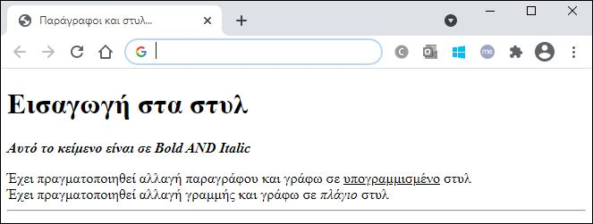
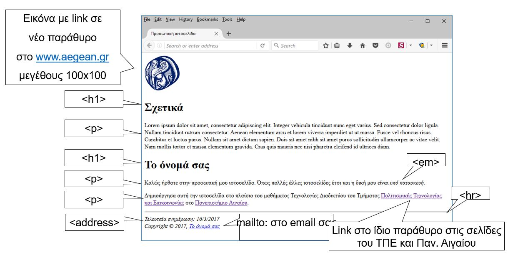
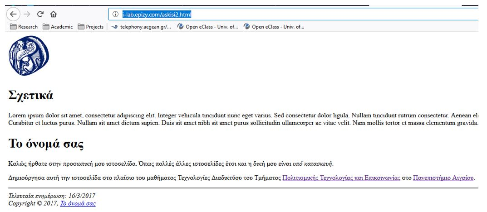

# Εργαστήριο 3

## Άσκηση 1

Δημιουργήστε ένα HTML αρχείο που θα εμφανίζεται στον browser ως εξής:



**ΛΥΣΗ ΑΣΚΗΣΗΣ 1**

```html
<!DOCTYPE html>
<html lang="el">
    <head>
        <meta charset="UTF-8">
        <title>Παράγραφοι και στυλ...</title>
    <head>
    <body>
        <h1>Εισαγωγή στα στυλ</h1>
        <p><b><i>Αυτό το κείμενο είναι σε Bold AND Italic</i></b></p>
        Έχει πραγματοποιηθεί αλλαγή παραγράφου και γράφω σε <u>υπογραμμισμένο</u> στυλ
        <br>
        Έχει πραγματοποιηθεί αλλαγή γραμμής και γράφω σε <i>πλάγιο</i> στυλ
        <br>
        <hr>
    </body>
</html>
```

## Άσκηση 2

Δημιουργήστε ένα HTML αρχείο που θα εμφανίζεται στον browser ως εξής:



**ΛΥΣΗ ΑΣΚΗΣΗΣ 2**

```html
<!DOCTYPE html>
<html lang="el">
    <head>
        <meta charset="UTF-8">
        <title>Προσωπική ιστοσελίδα</title>
    </head>
    <body>
        <a href="http://www.aegean.gr" target="_blank"></a>
        <h1>Σχετικά</h1>
        <p>Lorem ipsum dolor sit amet, consectetur adipiscing elit. Integer vehicula tincidunt nunc eget varius. Sed consectetur dolor ligula. Nullam tincidunt rutrum consectetur. Aenean elementum arcu et lorem viverra imperdiet ut ut massa. Fusce vel rhoncus risus. Curabitur et luctus purus. Nullam sit amet dictum sapien. Duis sit amet nibh sit amet purus sollicitudin ullamcorper ac vitae velit. Nam mollis tortor et massa elementum gravida. Cras quis mauris nec nisi pharetra eleifend id ultrices diam. </p>
        <h1>Ευστρατία Καζή</h1>
        <p>Καλώς ήρθατε στην προσωπική μου ιστοσελίδα. Όπως πολλές άλλες ιστοσελίδες έτσι και η δική μου είναι <em>υπό κατασκευή</em>.</p>
        <p>Δημιούργησα αυτή την ιστοσελίδα στο πλαίσιο του μαθήματος Τεχνολογίες Διαδικτύου του Τμήματος <a href="http://www.ct.aegean.gr/">Πολιτισμικής Τεχνολογίας και Επικοινωνίας</a>στο<a href="http://www.aegean.gr">Πανεπιστήμιο Αιγαίου</a>.</p>
        <hr>
        <address>
            Τελευταία ενημέρωση: 4/3/2021
            <br>
            Copyright &copy; <a href="mailto:ct20044@ct.aegean.gr">Efstratia Kazi</a>
        </address>
    </body>
</html>
```

## Άσκηση 3

Δημoσιεύστε το HTML αρχείο της άσκησης 2 σε ένα πάροχο δωρεάν φιλοξενίας ιστοσελίδων (free web hosting) π.χ. InfinityFree.net, atwebpages.com

Π.χ. `http://YOUR DOMAIN.epizy.com/askisi2.html`


