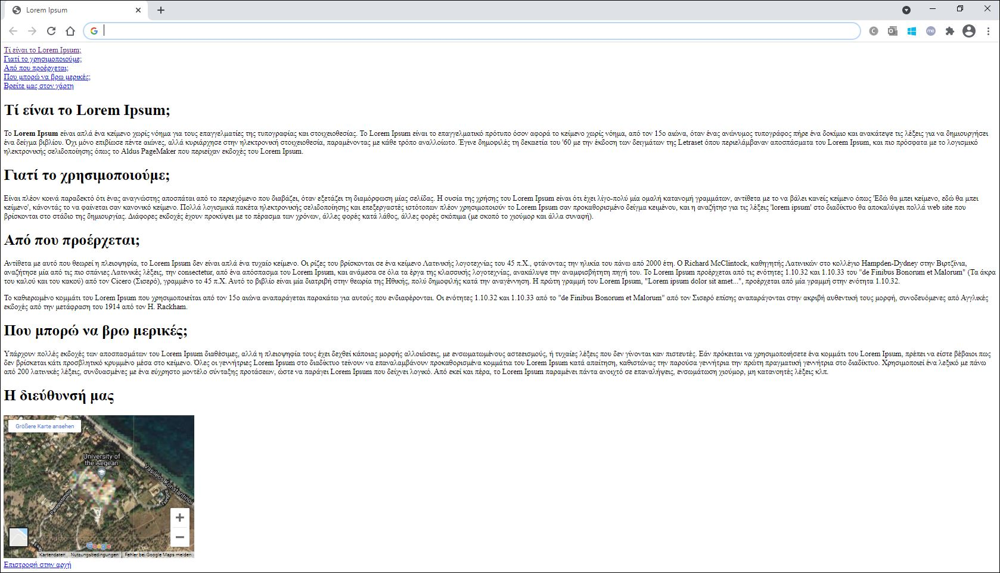
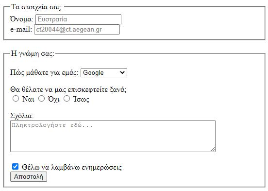

# Εργαστήριο 5

## Άσκηση 1 (id, Έξτρα σημάνσεις, εσωτερικοί σύνδεσμοι, iframes)



**ΛΥΣΗ ΑΣΚΗΣΗΣ 1**

```html
<!DOCTYPE html>
<html lang="el">
    <head>
        <meta charset="UTF-8">
        <title>Lorem Ipsum</title>
    </head>
    <body>
        <a id="start" href="#about">Τί είναι το Lorem Ipsum;</a>
        <br>
        <a href="#why">Γιατί το χρησιμοποιούμε;</a>
        <br>
        <a href="#where">Από που προέρχεται;</a>
        <br>
        <a href="#find">Που μπορώ να βρω μερικές;</a>
        <br>
        <a href="#map">Βρείτε μας στον χάρτη</a>
        <br>
        <h1 id="about">Τί είναι το Lorem Ipsum;</h1>
        <p>Το <b>Lorem Ipsum</b> είναι απλά ένα κείμενο χωρίς νόημα για τους επαγγελματίες της τυπογραφίας και στοιχειοθεσίας. Το Lorem Ipsum είναι το επαγγελματικό πρότυπο όσον αφορά το κείμενο χωρίς νόημα, από τον 15ο αιώνα, όταν ένας ανώνυμος τυπογράφος πήρε ένα δοκίμιο και ανακάτεψε τις λέξεις για να δημιουργήσει ένα δείγμα βιβλίου. Όχι μόνο επιβίωσε πέντε αιώνες, αλλά κυριάρχησε στην ηλεκτρονική στοιχειοθεσία, παραμένοντας με κάθε τρόπο αναλλοίωτο. Έγινε δημοφιλές τη δεκαετία του '60 με την έκδοση των δειγμάτων της Letraset όπου περιελάμβαναν αποσπάσματα του Lorem Ipsum, και πιο πρόσφατα με το λογισμικό ηλεκτρονικής σελιδοποίησης όπως το Aldus PageMaker που περιείχαν εκδοχές του Lorem Ipsum.</p>
        <h1 id="why">Γιατί το χρησιμοποιούμε;</h1>
        <p>Είναι πλέον κοινά παραδεκτό ότι ένας αναγνώστης αποσπάται από το περιεχόμενο που διαβάζει, όταν εξετάζει τη διαμόρφωση μίας σελίδας. Η ουσία της χρήσης του Lorem Ipsum είναι ότι έχει λίγο-πολύ μία ομαλή κατανομή γραμμάτων, αντίθετα με το να βάλει κανείς κείμενο όπως 'Εδώ θα μπει κείμενο, εδώ θα μπει κείμενο', κάνοντάς το να φαίνεται σαν κανονικό κείμενο. Πολλά λογισμικά πακέτα ηλεκτρονικής σελιδοποίησης και επεξεργαστές ιστότοπων πλέον χρησιμοποιούν το Lorem Ipsum σαν προκαθορισμένο δείγμα κειμένου, και η αναζήτησ για τις λέξεις 'lorem ipsum' στο διαδίκτυο θα αποκαλύψει πολλά web site που βρίσκονται στο στάδιο της δημιουργίας. Διάφορες εκδοχές έχουν προκύψει με το πέρασμα των χρόνων, άλλες φορές κατά λάθος, άλλες φορές σκόπιμα (με σκοπό το χιούμορ και άλλα συναφή).</p>
        <h1 id="where">Από που προέρχεται;</h1>
        <p>Αντίθετα με αυτό που θεωρεί η πλειοψηφία, το Lorem Ipsum δεν είναι απλά ένα τυχαίο κείμενο. Οι ρίζες του βρίσκονται σε ένα κείμενο Λατινικής λογοτεχνίας του 45 π.Χ., φτάνοντας την ηλικία του πάνω από 2000 έτη. Ο Richard McClintock, καθηγητής Λατινικών στο κολλέγιο Hampden-Dydney στην Βιρτζίνια, αναζήτησε μία από τις πιο σπάνιες Λατινικές λέξεις, την consectetur, από ένα απόσπασμα του Lorem Ipsum, και ανάμεσα σε όλα τα έργα της κλασσικής λογοτεχνίας, ανακάλυψε την αναμφισβήτητη πηγή του. To Lorem Ipsum προέρχεται από τις ενότητες 1.10.32 και 1.10.33 του "de Finibus Bonorum et Malorum" (Τα άκρα του καλού και του κακού) από τον Cicero (Σισερό), γραμμένο το 45 π.Χ. Αυτό το βιβλίο είναι μία διατριβή στην θεωρία της Ηθικής, πολύ δημοφιλής κατά την αναγέννηση. Η πρώτη γραμμή του Lorem Ipsum, "Lorem ipsum dolor sit amet...", προέρχεται από μία γραμμή στην ενότητα 1.10.32.</p>
        <p>Το καθιερωμένο κομμάτι του Lorem Ipsum που χρησιμοποιείται από τον 15ο αιώνα αναπαράγεται παρακάτω για αυτούς που ενδιαφέρονται. Οι ενότητες 1.10.32 και 1.10.33 από το "de Finibus Bonorum et Malorum" από τον Σισερό επίσης αναπαράγονται στην ακριβή αυθεντική τους μορφή, συνοδευόμενες από Αγγλικές εκδοχές από την μετάφραση του 1914 από τον H. Rackham.</p>
        <h1 id="find">Που μπορώ να βρω μερικές;</h1>
        <p>Υπάρχουν πολλές εκδοχές των αποσπασμάτων του Lorem Ipsum διαθέσιμες, αλλά η πλειοψηφία τους έχει δεχθεί κάποιας μορφής αλλοιώσεις, με ενσωματωμένους αστεεισμούς, ή τυχαίες λέξεις που δεν γίνονται καν πιστευτές. Εάν πρόκειται να χρησιμοποιήσετε ένα κομμάτι του Lorem Ipsum, πρέπει να είστε βέβαιοι πως δεν βρίσκεται κάτι προσβλητικό κρυμμένο μέσα στο κείμενο. Όλες οι γεννήτριες Lorem Ipsum στο διαδίκτυο τείνουν να επαναλαμβάνουν προκαθορισμένα κομμάτια του Lorem Ipsum κατά απαίτηση, καθιστώνας την παρούσα γεννήτρια την πρώτη πραγματική γεννήτρια στο διαδίκτυο. Χρησιμοποιεί ένα λεξικό με πάνω από 200 λατινικές λέξεις, συνδυασμένες με ένα εύχρηστο μοντέλο σύνταξης προτάσεων, ώστε να παράγει Lorem Ipsum που δείχνει λογικό. Από εκεί και πέρα, το Lorem Ipsum παραμένει πάντα ανοιχτό σε επαναλήψεις, ενσωμάτωση χιούμορ, μη κατανοητές λέξεις κλπ. </p>
        <h1 id="map">Η διεύθυνσή μας</h1>
        <iframe src="https://www.google.com/maps/embed?pb=!1m14!1m12!1m3!1d2975.7264996404074!2d26.568861022116838!3d39.08495827592178!2m3!1f0!2f0!3f0!3m2!1i1024!2i768!4f13.1!5e1!3m2!1sel!2sgr!4v1490371331858" width="400" height="300" frameborder="0" style="border:0" allowfullscreen></iframe>
        <br>
        <a href="#start">Επιστροφή στην αρχή</a>
    </body>
</html>
```

## Άσκηση 2 (Φόρμες)



**ΛΥΣΗ ΑΣΚΗΣΗΣ 2**

```html
<!DOCTYPE html>
<html lang="el">
    <head>
        <meta charset="UTF-8">
        <title>Φόρμες</title>
    </head>
    <body>
        <form>
            <fieldset>
                <legend>Τα στοιχεία σας:</legend>
                <label for="name">Όνομα:</label>
                <input type="text" name ="name" value="Ευστρατία" style="color: grey;">
                <br>
                <label for="email">e-mail:</label>
                <input type="email" name="email" value="ct20044@ct.aegean.gr" style="color: grey;">
            </fieldset>
            <br>
            <fieldset>
                <legend>H γνώμη σας:</legend>
                <p>
                    <label for="question">Πώς μάθατε για εμάς:</label>
                    <select name="referrer" id="question">
                        <option value="google">Google</option>
                        <option value="advert">Διαφήμιση</option>
                        <option value="education">Εκπαίδευση</option>
                        <option value="other">Άλλο</option>
                    </select>
                </p>
                <p> Θα θέλατε να μας επισκεφτείτε ξανά;
                    <br>
                    <input type="radio" name="answer" value="yes"> Ναι
                    <input type="radio" name="answer" value="no"> Όχι
                    <input type="radio" name="answer" value="maybe"> Ίσως
                </p>
                <p>
                    <label for="comments">Σχόλια:</label>
                    <br>
                    <textarea rows="4" cols="50" name="comments" form="userform" style="color: grey;">Πληκτρολογήστε εδώ...</textarea>
                </p>
                <input type="checkbox" name="notifications" checked="checked">
                <label for="vehicle1">Θέλω να λαμβάνω ενημερώσεις</label>
                <br>
                <input type="submit" value="Αποστολή">
            </fieldset>
        </form>
    </body>
</html>
```

## Άσκηση 3 (iframes)

Δημιουργήστε ιστοσελίδα (αρχείο.html) για ένα αρχαιολογικό χώρο ή μουσειακό έκθεμα, όπως το επισυναπτόμενο παράδειγμα για το Κάστρο της Μυτιλήνης (askisi3.html), που να περιέχει:

1. Ενσωμάτωση (embed) φωτογραφίας ή/και βίντεο 360ο  (από Momento360.com, YouTube.com, ή άλλη υπηρεσία online)
2. Ενσωμάτωση χάρτη (Google map) της περιοχής που βρίσκεται.
3. `<header>` και `<footer>` ετικέτες με σχετικό περιεχόμενο (τίτλο σελίδας, σύντομη περιγραφή, στοιχεία επικοινωνίας με τον δημιουργό της σελίδας, δηλ. εσάς π.χ., το e-mail σας).

**ΛΥΣΗ ΑΣΚΗΣΗΣ 3**

```html
<!DOCTYPE html>
<html>
    <head>
        <meta http-equiv="content-type" content="text/html; charset=UTF-8">
        <meta name="viewport" content="width=device-width, initial-scale=1, minimum-scale=1">
        <meta name="description" content="">
        <title>Η πρώτη μου εργασία για το Κάστρο της Μυτιλήνης</title>
    </head>
    <body>
        <article>
            <header>
                <h1>Most important heading here</h1>
                <h2>Less important heading here</h2>
                <p>Some additional information here</p>
            </header>
            <p>Lorem Ipsum dolor set amet....</p>
        </article>
        <h1 style="  text-align: center;"> 
            <b>360 photo embed from Momento360.com</b>
        </h1>
        <div style="text-align: center;"> 
            <iframe allowfullscreen="true" src="https://momento360.com/e/u/c105ed2a342948e3b7ac9103731e3f0c?utm_campaign=embed&utm_source=other&utm_medium=other&heading=37.680548580319766&pitch=-1.8758028382333025&field-of-view=75" height="350px" width="100%"> 
            </iframe> 
        </div>
        <hr>
        <h1 style="  text-align: center;"> 
            <b>Virtual Tour embed from Google's Poly Creator</b>
        </h1>
        <div style="text-align: center;">
            <iframe width="100%" height="480px" src="https://poly.google.com/view/9YitmeT-rQ-/embed?chrome=min" frameborder="0" style="border:none;" allowvr="yes" allow="vr; xr; accelerometer; magnetometer; gyroscope; autoplay;" allowfullscreen mozallowfullscreen="true" webkitallowfullscreen="true" onmousewheel="" ></iframe>
        </div>
        <hr>
        <h1 style="  text-align: center;"> 
            <b>360 video embed from YouTube.com</b>
        </h1>
        <div style="text-align: center;">  
            <iframe width="560" height="315" src="https://www.youtube.com/embed/R6154BEyKs0" frameborder="0" allow="accelerometer; autoplay; encrypted-media; gyroscope; picture-in-picture" allowfullscreen></iframe> 
        </div>
        <hr>
        <h1 style="  text-align: center;"> 
            <b>Google Map</b>
        </h1>
        <div style="text-align: center;"> 
            <iframe src="https://www.google.com/maps/embed?pb=!1m18!1m12!1m3!1d3095.782541507557!2d26.560073914653547!3d39.111420741906365!2m3!1f0!2f0!3f0!3m2!1i1024!2i768!4f13.1!3m3!1m2!1s0x14ba67a9e720eb1f%3A0x9f8fc4cfbf36b6a7!2sCastle%20of%20Mytilene!5e0!3m2!1sen!2sgr!4v1582961279769!5m2!1sen!2sgr" width="600" height="450" frameborder="0" style="border:0;" allowfullscreen="">
            </iframe>
        </div>
        <footer>
            <p>Created by: Efstratia Kazi</p>
            Τελευταία ενημέρωση: 29/2/2021
            <br>
            <address>
                Copyright &copy; 2020, <a href="mailto:ct20044@ct.aegean.gr">Το όνομά σας</a>
            </address>
        </footer>
    </body>
</html>
```
