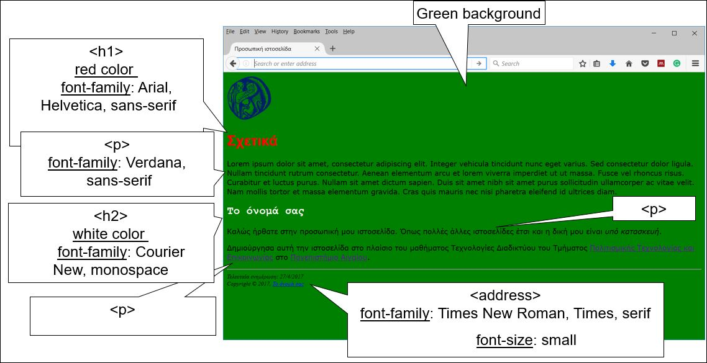
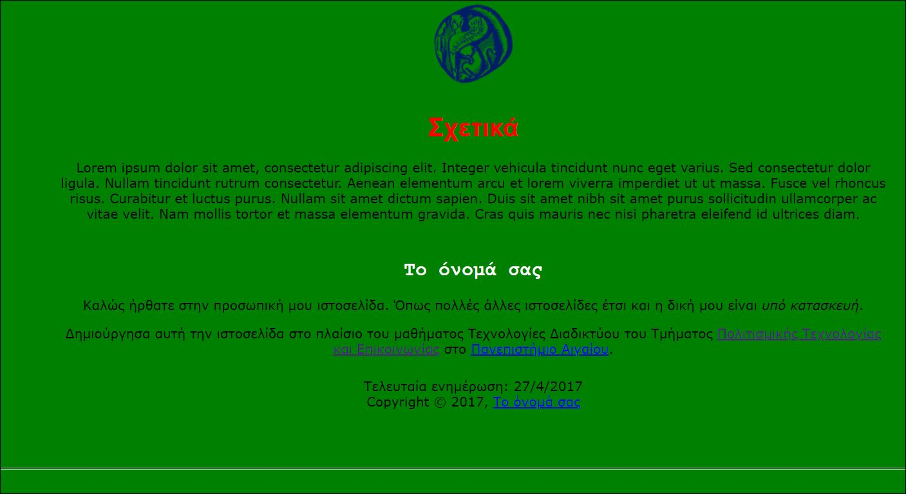

# Εργαστήριο 6

## Άσκηση 1

Δημιουργήστε ένα HTML και ένα CSS αρχείo που θα εμφανίζονται στον browser ως εξής:



**ΛΥΣΗ ΑΣΚΗΣΗΣ 1**

Κώδικας **CSS**:

```css
/**********************************************
CHANGING THE STYLE OF THE STRUCTURAL ELEMENTS
**********************************************/

body {
    background: green;
}

body,
p {
    font-family: Verdana, sans-serif;
}

address {
    font-family: Times New Roman, Times, serif;
    font-size: small;
}


/*******************************************
CHANGING THE STYLE OF THE HEADING ELEMENTS
*******************************************/

h1 {
    color: red;
    font-family: Arial, Helvetica, sans-serif;
}

h2 {
    color: white;
    font-family: Courier New, monospace;
}
```

Κώδικας **HTML**:

```html
<!DOCTYPE html>
<html lang="el">
    <head>
        <title>Προσωπική ιστοσελίδα</title>
        <link rel="stylesheet" type="text/css" href="style.css">
    </head>
    <body>
        <a href="http://www.aegean.gr" target="_blank"></a>
        <h1>Σχετικά</h1>
        <p>Lorem ipsum dolor sit amet, consectetur adipiscing elit. Integer vehicula tincidunt nunc eget varius. 
            Sed consectetur dolor ligula. Nullam tincidunt rutrum consectetur. Aenean elementum arcu et lorem 
            viverra imperdiet ut ut massa. Fusce vel rhoncus risus. Curabitur et luctus purus. 
            Nullam sit amet dictum sapien. Duis sit amet nibh sit amet purus sollicitudin ullamcorper ac vitae velit. 
            Nam mollis tortor et massa elementum gravida. Cras quis mauris nec nisi pharetra eleifend id ultrices diam.
        </p>
        <h2>Το όνομά σας</h2>
        <p>Καλώς ήρθατε στην προσωπική μου ιστοσελίδα. Όπως πολλές άλλες ιστοσελίδες έτσι και η δική μου είναι <em>υπό κατασκευή</em>.</p>
        <p>Δημιούργησα αυτή την ιστοσελίδα στο πλαίσιο του μαθήματος Τεχνολογίες Διαδικτύου του Τμήματος
            <a href="http://www.ct.aegean.gr/">Πολιτισμικής Τεχνολογίας και Επικοινωνίας</a>
            στο
            <a href="http://www.aegean.gr">Πανεπιστήμιο Αιγαίου</a>.
        </p>
        <hr>
        <address>
            Τελευταία ενημέρωση: 27/4/2017
            <br>
            Copyright &copy; 2017, <a href="mailto:ct20044@ct.aegean.gr">Efstratia Kazi</a>
        </address>
    </body>
</html>
```

## Άσκηση 2

Όπως η Άσκηση 1, αλλά το περιεχόμενο να τοποθετηθεί σε πίνακα, με στοίχιση στο κέντρο (του πίνακα και του περιεχομένου κάθε κελιού).



**ΛΥΣΗ ΑΣΚΗΣΗΣ 2**

```html
<!DOCTYPE html>
<html lang="el">
    <head>
        <meta content="text/html; charset=UTF-8" http-equiv="content-type">
        <title>Προσωπική ιστοσελίδα</title>
        <link rel="stylesheet" type="text/css" href="style.css">
    </head>
    <body>
        <a href="http://www.aegean.gr" target="_blank"> </a>
        <table style="width: 1037px; height: 518px;" align="center" border="0">
            <tbody>
                <tr align="center">
                    <td><a href="http://www.aegean.gr" target="_blank"></a></td>
                </tr>
                <tr align="center">
                    <td>
                        <h1>Σχετικά</h1>
                        <p>Lorem ipsum dolor sit amet, consectetur adipiscing elit. Integer
                            vehicula tincidunt nunc eget varius. Sed consectetur dolor ligula.
                            Nullam tincidunt rutrum consectetur. Aenean elementum arcu et
                            lorem viverra imperdiet ut ut massa. Fusce vel rhoncus risus.
                            Curabitur et luctus purus. Nullam sit amet dictum sapien. Duis sit
                            amet nibh sit amet purus sollicitudin ullamcorper ac vitae velit.
                            Nam mollis tortor et massa elementum gravida. Cras quis mauris nec
                            nisi pharetra eleifend id ultrices diam.
                        </p>
                    </td>
                </tr>
                <tr align="center">
                    <td>
                        <h2>Το όνομά σας</h2>
                        <p>Καλώς ήρθατε στην προσωπική μου ιστοσελίδα. Όπως πολλές άλλες
                            ιστοσελίδες έτσι και η δική μου είναι <em>υπό κατασκευή</em>.
                        </p>
                        <p>Δημιούργησα αυτή την ιστοσελίδα στο πλαίσιο του μαθήματος
                            Τεχνολογίες Διαδικτύου του Τμήματος <a href="http://www.ct.aegean.gr/">Πολιτισμικής
                            Τεχνολογίας και Επικοινωνίας</a> στο <a href="http://www.aegean.gr">Πανεπιστήμιο
                            Αιγαίου</a>.
                        </p>
                    </td>
                </tr>
                <tr>
                    <td>
                        <footer>
                            <address>
                                <div style="text-align: center;">Τελευταία ενημέρωση: 27/4/2021 </div>
                                <div style="text-align: center;"> Copyright © 2021, <a href="mailto:ct20044@ct.aegean.gr">Efstratia Kazi</a></div>
                            </address>
                        </footer>
                    </td>
                </tr>
            </tbody>
        </table>
        <br>
        <br>
        <br>
        <hr>
    </body>
</html>
```
