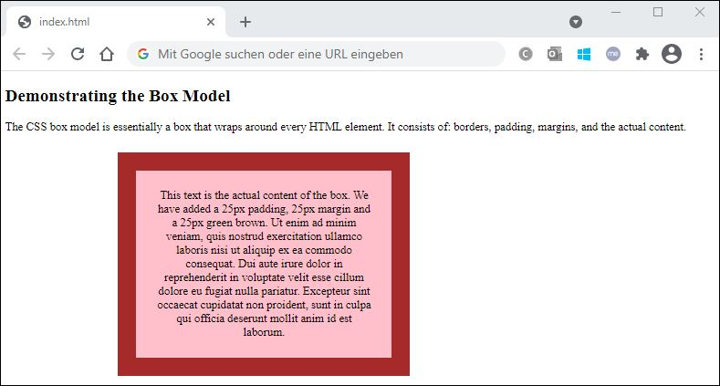
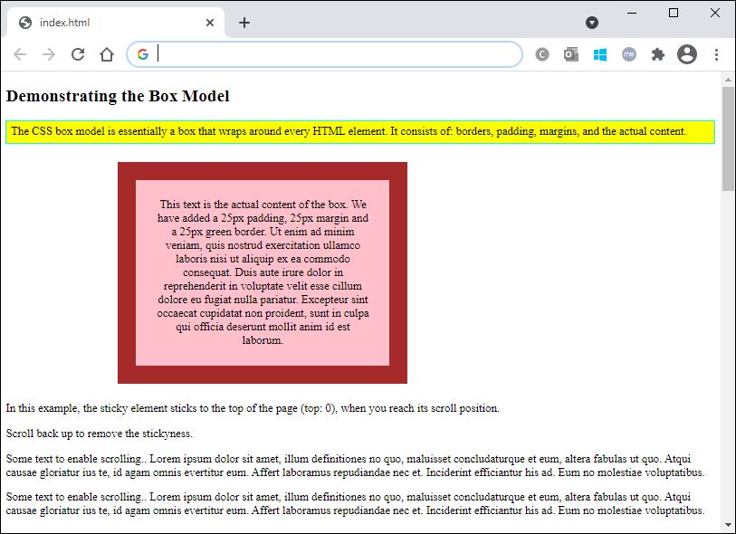

# Εργαστήριο 7

## Άσκηση 1



**ΛΥΣΗ ΑΣΚΗΣΗΣ 1**

Κώδικας **CSS**:

```css
.edit {
    background-color: pink;
    border: 25px solid brown;
    text-align: center;
    position: relative;
    padding: 25px;
    width: 300px;
    margin: 25px;
    left: 130px;
}

.rel {
    border: 25px solid brown;
    background-color: pink;
    text-align: center;
    position: relative;
    padding: 25px;
    width: 300px;
    margin: 25px;
    left: 130px;
}

.stc {
    position: -webkit-sticky;
    background-color: yellow;
    border: 2px solid cyan;
    position: sticky;
    padding: 5px;
    top: 0;
}
```

Κώδικας **HTML**:

```html
<!DOCTYPE html>
<html>
    <head>
        <link rel="stylesheet" type="text/css" href="style.css"/>
    </head>
    <body>
        <h2>Demonstrating the Box Model</h2>
        <p>The CSS box model is essentially a box that wraps around every HTML element. 
            It consists of: borders, padding, margins, and the actual content.
        </p>
        <p class="edit">This text is the actual content of the box. We have added a 
            25px padding, 25px margin and a 25px green brown. Ut enim ad minim veniam, 
            quis nostrud exercitation ullamco laboris nisi ut aliquip ex ea commodo 
            consequat. Dui aute irure dolor in reprehenderit in voluptate velit esse 
            cillum dolore eu fugiat nulla pariatur. Excepteur sint occaecat cupidatat 
            non proident, sunt in culpa qui officia deserunt mollit anim id est laborum.
        </p>
    </body>
</html>
```

## Άσκηση 2



**ΛΥΣΗ ΑΣΚΗΣΗΣ 2**

Κώδικας **CSS**:

```css
.edit {
    background-color: pink;
    border: 25px solid brown;
    text-align: center;
    position: relative;
    padding: 25px;
    width: 300px;
    margin: 25px;
    left: 130px;
}

.rel {
    border: 25px solid brown;
    background-color: pink;
    text-align: center;
    position: relative;
    padding: 25px;
    width: 300px;
    margin: 25px;
    left: 130px;
}

.stc {
    position: -webkit-sticky;
    background-color: yellow;
    border: 2px solid cyan;
    position: sticky;
    padding: 5px;
    top: 0;
}
```

Κώδικας **HTML**:

```html
<!DOCTYPE html>
<html>
    <head>
        <link rel="stylesheet" type="text/css" href="style.css"/>
    </head>
    <body>
        <h2>Demonstrating the Box Model</h2>
        <div class="stc">The CSS box model is essentially a box that wraps around every HTML element. 
            It consists of: borders, padding, margins, and the actual content.
        </div>
        <div class="rel">This text is the actual content of the box. We have added a 25px padding, 25px margin and a 25px green border. Ut enim ad minim veniam, quis nostrud exercitation ullamco laboris nisi ut aliquip ex ea commodo consequat. Duis aute irure dolor in reprehenderit in voluptate velit esse cillum dolore eu fugiat nulla pariatur. Excepteur sint occaecat cupidatat non proident, sunt in culpa qui officia deserunt mollit anim id est laborum.</div>
        <div style="padding-bottom:2000px">
            <p>In this example, the sticky element sticks to the top of the page (top: 0), when you reach its scroll position.</p>
            <p>Scroll back up to remove the stickyness.</p>
            <p>Some text to enable scrolling.. Lorem ipsum dolor sit amet, illum definitiones no quo, maluisset concludaturque et eum, altera fabulas ut quo. Atqui causae gloriatur ius te, id agam omnis evertitur eum. Affert laboramus repudiandae nec et. Inciderint efficiantur his ad. Eum no molestiae voluptatibus.</p>
            <p>Some text to enable scrolling.. Lorem ipsum dolor sit amet, illum definitiones no quo, maluisset concludaturque et eum, altera fabulas ut quo. Atqui causae gloriatur ius te, id agam omnis evertitur eum. Affert laboramus repudiandae nec et. Inciderint efficiantur his ad. Eum no molestiae voluptatibus.</p>
        </div>
    </body>
</html>
```
