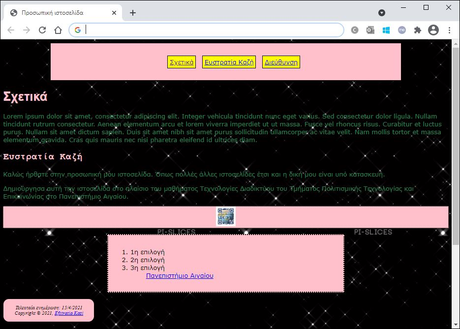

# Εργαστήριο 8

## Άσκηση 1

Δημιουργήστε ένα HTML και ένα CSS αρχεία που θα εμφανίζονται στον browser ως εξής:



**ΛΥΣΗ ΑΣΚΗΣΗΣ 1**

Κώδικας **CSS**:

```css
body {
    background: url(../gif/stars.gif);
}

body,
p {
    font-family: Verdana, sans-serif;
}

nav {
    border: 3px double #000;
    background: pink;
    text-align: center;
    margin: auto;
    padding: 20px;
    width: 75%;
}

address {
    font-family: "Times New Roman", Times, serif;
    border: 1px solid black;
    border-radius: 15px;
    text-align: center;
    background: pink;
    font-size: small;
    padding: 15px;
    width: 200px;
}

h1 {
    color: pink;
    font-family: Arial, Helvetica, sans-serif;
}

h2 {
    color: pink;
    font-family: "Courier New", monospace;
}

nav a {
    border: 1px solid black;
    background: yellow;
    padding: 5px;
    margin: 5px;
}

ul li {
    display: inline;
    list-style: none;
}

p {
    color: rgb(43, 129, 86);
}

#mainsection {
    background: pink;
    border: 3px dotted black;
    width: 50%;
    margin: 15px auto;
    padding: 15px;
}

.logotypo {
    text-align: center;
    background: pink;
    border: 1px dotted black;
}
```

Κώδικας **HTML**:

```html
<!DOCTYPE html>
<html lang="el">
    <head>
        <meta charset="UTF-8">
        <title>Προσωπική ιστοσελίδα</title>
        <link 
            rel="stylesheet"
            type="text/css"
            href="css/style.css"/>
    </head>
    <body>
        <div id="#top">
            <nav>
                <ul>
                    <li>
                        <a href="#about">Σχετικά</a>
                    </li>
                    <li>
                        <a href="#name">Ευστρατία Καζή</a>
                    </li>
                    <li>
                        <a href="#bottom">Διεύθυνση</a>
                    </li>
                </ul>
            </nav>
        </div>
        <h1 id="about">Σχετικά</h1>
        <p>Lorem ipsum dolor sit amet, consectetur adipiscing elit.
            Integer vehicula tincidunt nunc eget varius. Sed consectetur 
            dolor ligula. Nullam tincidunt rutrum consectetur. Aenean 
            elementum arcu et lorem viverra imperdiet ut ut massa. 
            Fusce vel rhoncus risus. Curabitur et luctus purus. 
            Nullam sit amet dictum sapien. Duis sit amet nibh sit 
            amet purus sollicitudin ullamcorper ac vitae velit. 
            Nam mollis tortor et massa elementum gravida. Cras quis 
            mauris nec nisi pharetra eleifend id ultrices diam.
        </p>
        <h2 id="name">Ευστρατία Καζή</h2>
        <p>Καλώς ήρθατε στην προσωπική μου ιστοσελίδα. 
            Όπως πολλές άλλες ιστοσελίδες έτσι και η δική 
            μου είναι υπό κατασκευή.
        </p>
        <p>Δημιούργησα αυτή την ιστοσελίδα στο πλαίσιο του 
            μαθήματος Τεχνολογίες Διαδικτύου του Τμήματος Πολιτισμικής 
            Τεχνολογίας και Επικοινωνίας στο Πανεπιστήμιο Αιγαίου.
        </p>
        <div class="logotypo"> 
            
        </div>
        <div id="mainsection">
            <ol>
                <li>1η επιλογή</li>
                <li>2η επιλογή</li>
                <li>3η επιλογή</li>
                <ul>
                    <li><a id="bottom" href="https://www.aegean.gr/" target="_blank">Πανεπιστήμιο Αιγαίου</a></li>
                    </li>
                </ul>
            </ol>
        </div>
        <footer>
            <address>
                Τελευταία ενημέρωση: 15/4/2021
                <br>
                Copyright &copy; 2021, <a href="mailto:youremail@yourisp.com">Efstratia Kazi</a>
            </address>
        </footer>
        <p style="text-align:center; padding-bottom:250px;">
            <a href="#top">Top</a> 
        </p>
    </body>
</html>
```

## Άσκηση 2


### Zητούμενα:

- Δημιουργήστε δύο ξεχωριστά αρχεία για HTML και CSS με ονόματα **index.html** και **style.css**
- Δημιουργήστε έναν φάκελο **css** όπου εκεί μέσα θα τοποθετήσετε το style.css
- Δημιουργήστε έναν φάκελο **images** όπου εκεί μέσα θα τοποθετήσετε τις δύο εικόνες
Επιλέξτε γραμματοσειρές για την ιστοσελίδα σας με τη σειρά τις: Trebuchet MS, Verdana και sans-serif
- Οι υπερσύνδεσμοι δεν πρέπει να είναι εξορισμού υπογραμμισμένοι. Όταν ο χρήστης πηγαίνει πάνω από τον υπερσύνδεσμο (hover) τότε θα υπογραμμίζεται (ψευδο-κλάσεις)
- Οι παράγραφοι πρέπει να αρχίζουν με το πρώτο γράμμα να είναι 1,5 φορές το κανονικό γράμμα και έντονο. (ψευδο-στοιχεία)
- Η λίστα με τις αγαπημένες ταινίες θα είναι σύνθετη λίστα, όπου στην τελευταία ταινία θα εμφανίζονται και πρόσθετες πληροφορίες με την μορφή λίστας ορισμών (4ο μάθημα) σε μικρότερο μέγεθος (π.χ. 75%) από τη γραμματοσειρά της ταινίας.


**ΛΥΣΗ ΑΣΚΗΣΗΣ 2**

Κώδικας **CSS**:

```css
body {
    font-family: "Trebuchet MS", Verdana, sans-serif;
    color: white;
    background-color: pink;
}

h1 {
    font-size: 40pt;
    color: blue;
    text-align: center;
}

h2 {
    color: blue;
}

a {
    color: green;
}

b {
    color: brown;
}

a:hover {
    color: black;
    text-decoration: underline;
}

a:active {
    color: blue;
    text-decoration: underline;
}

p::first-letter {
    font-weight: bold;
    color: green;
    font-size: 150%;
}

dl {
    font-size: 75%;
}

dt {
    color: brown;
    font-weight: bold;
}
```

Κώδικας **HTML**:

```html
<!DOCTYPE html>
<html lang="el">
    <head>
        <meta charset="UTF-8">
        <title>Ευστρατία Καζή</title>
        <link 
            rel="stylesheet" 
            type="text/css" 
            href="css/style.css"/>
    </head>
    <body>
        <h1>Ευστρατία Καζή</h1>
        <p>Ονομάζομαι Ευστρατία Καζή και είμαι <b>φοιτητρια</b>,
            στο <b>Τμήμα Πολιτισμικής Τεχνολογίας και Επικοινωνίας</b> 
            του <b>Πανεπιστημίου Αιγαίου</b>
        </p>
        <hr>
        <h2>Τα μαθήματά μου αυτό το εξάμηνο</h2>
        <p>Τα μαθήματα που παρακολουθώ αυτό το εξάμηνο είναι:</p>
        <ul>
            <li>ΠΛΡ101: ΤΕΧΝΟΛΟΓΙΕΣ ΠΟΛΥΜΕΣΩΝ</li>
            <li>ΠΛΡ104: TΕΧΝΟΛΟΓΙΕΣ ΔΙΑΔΙΚΤΥΟΥ</li>
            <li>ΠΛΡ132: ΑΛΓΟΡΙΘΜΟΙ ΚΑΙ ΔΟΜΕΣ ΔΕΔΟΜΕΝΩΝ</li>
            <li>ΠΟΛ205: ΕΙΣΑΓΩΓΗ ΣΤΗΝ ΠΟΛΙΤΙΣΤΙΚΗ ΚΛΗΡΟΝΟΜΙΑ</li>
            <li>ΠΟΛ410: ΣΥΓΓΡΑΦΗ ΕΡΓΑΣΙΩΝ</li>
        </ul>
        <h2>Η αγαπημένη μου ταινία</h2>
        <p>H αγαπημένη μου ταινία είναι:</p>
        <p><b>Inception</b>(<a href="https://www.imdb.com/title/tt1375666/?ref_=fn_al_tt_1" target="_blank">IMDB</a>)</p>
        <dl>
            <dt>Σκηνοθέτης</dt>
            <dd>Christopher Edward Nolan</dd>
            <dt>Είδος</dt>
            <dd>Δράση, Περιπέτεια</dd>
            <dt>Πλοκή</dt>
            <dd>Ένας κλέφτης που κλέβει εταιρικά μυστικά μέσω της χρήσης της τεχνολογίας κοινής χρήσης των ονείρων έχει το αντίστροφο καθήκον να τοποθετήσει μια ιδέα στο μυαλό ενός Διευθύνοντος Συμβούλου.</dd>
        </dl>
        <h2>Η διάθεσή μου</h2>
        Happy: <br> 
        
        <br>
        Sad: <br> 
        
    </body>
</html
```
