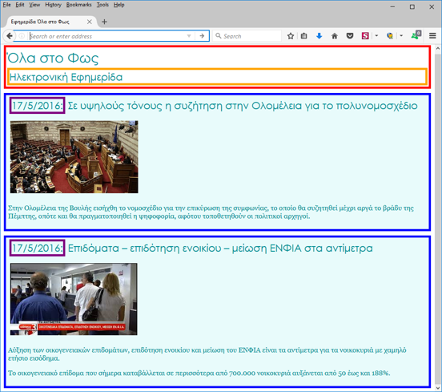

# Εργαστήριο 9

## Άσκηση 1

Καλείστε να κάνετε τις απαραίτητες τροποποιήσεις στα αρχεία index.html και style.css ώστε η σελίδα να εμφανίζεται ως εξής:



Συγκεκριμένα στο style.css:

- Τα πλαίσια (borders) είναι 5px thick και solid.
- Για χρώματα μπορείτε να χρησιμοποιήσετε ότι θέλετε.
- Για να λειτουργήσει όμως το CSS πρέπει να προσθέσετε στην HTML id, class, div και span.


**ΛΥΣΗ ΑΣΚΗΣΗΣ 1**

1ος κώδικας **CSS** (basic.css):

```css
body {
    font-family: "Georgia";
    color: #009097;
}

h1,
h2 {
    font-weight: normal;
    font-family: "Century Gothic";
    margin: 3px;
    padding: 0px;
}

img {
    border-style: none;
    padding: 5px;
}
```

2ος κώδικας **CSS** (style.css):

```css
#header {
    background-color: white;
    border: 5px green solid;
}

#header h2 {
    border: 5px orange solid;
}

.date {
    border: 5px purple solid;
}

.entry {
    border: 5px blue solid;
    padding: 5px;
    background-color: #E8FBFB;
    margin-top: 10px;
}

#header {
    border: 5px red solid;
}

#header h2 {
    border: 5px orange solid;
}
```

Κώδικας **HTML** (index.html):

```html
<!DOCTYPE html>
<html>
    <head>
        <title>Εφημερίδα Όλα στο Φως</title>
        <link rel="stylesheet" type="text/css" href="css/basic.css" />
        <link rel="stylesheet" type="text/css" href="css/style.css" />
    </head>
    <body>
        <div id="header">
            <h1>Όλα στο Φως</h1>
            <h2>Ηλεκτρονική Εφημερίδα</h2>
        </div>
        <div class="entry">
            <h2><span class="date">17/5/2016:</span> Σε υψηλούς τόνους η συζήτηση στην Ολομέλεια για το πολυνομοσχέδιο</h2>
            <p></p>
            <p>
                Στην Ολομέλεια της Βουλής εισήχθη το νομοσχέδιο για την επικύρωση της συμφωνίας, το οποίο θα συζητηθεί μέχρι αργά το βράδυ της Πέμπτης, οπότε και θα πραγματοποιηθεί η ψηφοφορία, αφότου τοποθετηθούν οι πολιτικοί αρχηγοί.
            </p>
            <p class="spacer"></p>
        </div>
        <div class="entry">
            <h2><span class="date">17/5/2016:</span> Επιδόματα – επιδότηση ενοικίου – μείωση ΕΝΦΙΑ στα αντίμετρα</h2>
            <p>
                
            </p>
            <p>
                Αύξηση των οικογενειακών επιδομάτων, επιδότηση ενοικίου και μείωση του ΕΝΦΙΑ είναι τα αντίμετρα για τα νοικοκυριά με χαμηλό ετήσιο εισόδημα. 
            </p>
            <p>
                Το οικογενειακό επίδομα που σήμερα καταβάλλεται σε περισσότερα από 700.000 νοικοκυριά αυξάνεται από 50 έως και 188%.
            </p>
        </div>
    </body>
</html>
```
