

# Διαδίκτυο και Ιστός

## Δίκτυα Η/Υ

Δίκτυο υπολογιστών (computer network): δύο τουλάχιστον Η/Υ συνδεδεμένοι ώστε να μπορούν να μοιράζονται δεδομένα και πόρους.

**Δομικά στοιχεία ενός δικτύου**:

- Υπολογιστικό σύστημα (host), π.χ. PCs, σταθμοί εργασίας, εξυπηρετητές δικτύου (network servers)
- Κόμβος (node), δηλ. σημεία συνάντησης γραμμών επικοινωνίας
- Περιφερειακές συσκευές δικτύου (network peripherals), όπως εκτυπωτές, modem, κ.λπ.
- Υποδίκτυο επικοινωνίας (communication subnet): καλωδίωση, γραμμές μετάδοσης

Κάθε Η/Υ έχει τη δική του διεύθυνση δικτύου, που τον χαρακτηρίζει μονοσήμαντα.

## Χρησιμότητα Δικτύων Η/Υ

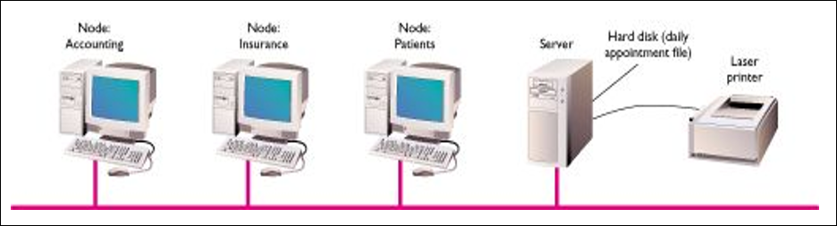

- Διαμοίραση πόρων (εκτυπωτές, αποθηκευτικός χώρος, επεξεργαστική ισχύς)
- Ανταλλαγή πληροφοριών, μηνυμάτων, αρχείων
- Συντονισμός εργασιών – Ομαδική εργασία
- Ευκολότερη αποθήκευση εφεδρικών αρχείων (backup)

## Κατηγοριοποίηση Δικτύων βάσει Μεγέθους

- Τοπικό δίκτυο (Local Area Network, LAN)
- Δίκτυο ευρείας ζώνης (Wide Area Network, WAN)
- Διαδίκτυο (Internet)

## Τοπικά Δίκτυα

Ένα Τοπικό Δίκτυο (Local-Area Network, LAN) καλύπτει μια μικρή απόσταση και ένα μικρό αριθμό Η/Υ.

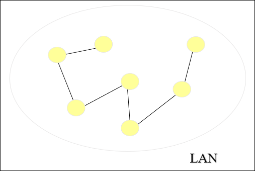

Ένα **LAN** συνήθως συνδέει υπολογιστικά συστήματα σε ένα δωμάτιο ή ένα κτίριο

## Πως Είναι Δομημένα τα Δίκτυα – LANs

Στα LANs οι Η/Υ απέχουν μικρές αποστάσεις. Οι κόμβοι μπορούν να είναι συνδεδεμένοι με καλώδιο ή υπέρυθρη  σύνδεση.

Ένα δίκτυο διαβιβάζει δεδομένα μεταξύ των υπολογιστών διασπώντας τα σε μικρά κομμάτια, τα πακέτα.

Κάθε LAN χρησιμοποιεί ένα πρωτόκολλο – ένα σύνολο κανόνων το οποίο καθορίζει πως είναι διαμορφωμένα τα πακέτα και πως μεταφέρονται.

## Δίκτυα Ευρείας Περιοχής

Ένα Ευρείας Περιοχής Δίκτυο (Wide-Area Network, WAN) συνδέει δύο τουλάχιστον LANs, συχνά σε μεγάλες αποστάσεις.

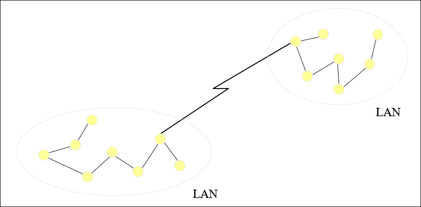

Ένα LAN ανήκει συνήθως σε κάποιον οργανισμό, αλλά ένα WAN συχνά συνδέει διαφορετικές ομάδες σε διαφορετικές χώρες.

## WANs

Πολλά LANs μπορούν να συνδεθούν χρησιμοποιώντας συσκευές όπως οι bridges (γέφυρες), routers (δρομολογητές), ή gateways (πύλες).

Ένα WAN συνδέει δύο τουλάχιστον LANs συνδεδεμένα μαζί. Τα LANs μπορούν να είναι χιλιόμετρα μακριά.

Για να καλύπτουν μεγάλες αποστάσεις, τα WANs  πρέπει να διαβιβάζουν δεδομένα μέσω μισθωμένων τηλεφωνικών γραμμών υψηλής ταχύτητας ή ασύρματες συνδέσεις όπως οι δορυφορικές.

## Τα WANs είναι διασυνδέσεις LANs

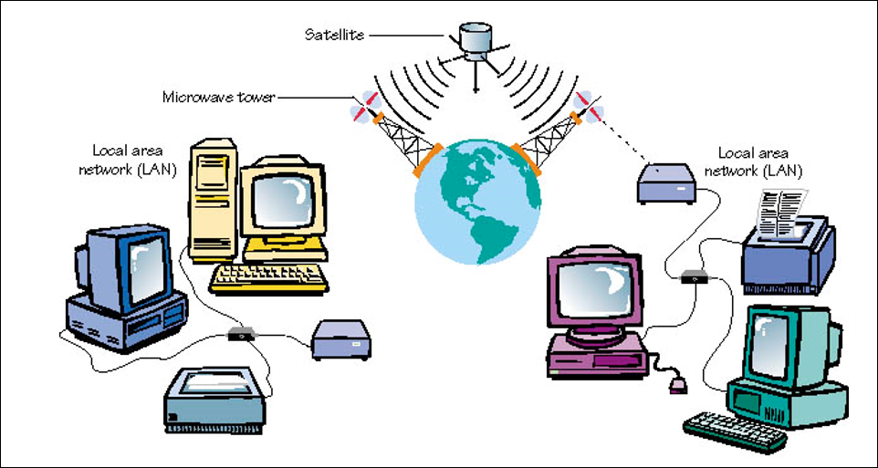

## Δίκτυα πελάτη/διακομιστή (client/server)

Πολλοί πελάτες μοιράζονται τις υπηρεσίες (δεδομένα και προγράμματα) ενός κεντρικού διακομιστή.

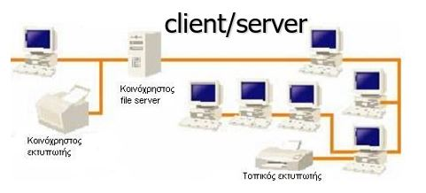

## Ισότιμα δίκτυα (peer-to-peer)

Όλοι οι Η/Υ μοιράζονται ισότιμα με τους άλλους, χωρίς να βασίζονται σε κάποιον εξυπηρέτη.

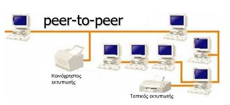

## Κατηγορίες διακομιστών (Servers)

- File server
- Printer server
- Mail server
- Web server
- FTP server

## Κατηγορίες συνδέσεων

- Άμεση σύνδεση
- Απομακρυσμένη σύνδεση
  - Τηλεφωνικό δίκτυο
  - Δίκτυο καλωδιακής τηλεόρασης
  - Δορυφορική σύνδεση

## Το Διαδίκτυο (Internet)

- Το Διαδίκτυο είναι ένα WAN που καλύπτει ολόκληρο τον πλανήτη.
- Η λέξη Internet από τον όρο internetworking, ο οποίος υποδηλώνει επικοινωνία μεταξύ δικτύων.
- Ξεκίνησε σαν ένα ερευνητικό πρόγραμμα της κυβέρνησης των ΗΠΑ, επιχορηγούμενο από την Advanced Research Projects Agency (ARPA). Αρχικά ονομάζονταν ARPANET.
- Το Internet αναπτύχθηκε γρήγορα στις δεκαετίες των 80-90.
- Το 1983 ήταν συνδεδεμένοι στο Internet λιγότεροι από 600 Η/Υ, ενώ τώρα υπάρχουν δεκάδες εκατομμύρια.

## Internet vs. Web

Tο Internet (Διαδίκτυο) συχνά συγχέεται με τις υπηρεσίες που παρέχονται επί του Internet. Κυρίως συγχέεται με το WWW (Παγκόσμιο Ιστό). Τέτοιες δημοφιλείς υπηρεσίες είναι οι:

- The World Wide Web (ΗTTP protocol)
- E-Mail (smtp protocol)
- File Transfer Protocol (FTP protocol)
- Web 2.0 - Collaborative Knowledge creation (Wikis e.g. Wikipedia, Wikidata, Wikibooks,…)
- Web 3.0 – Semantic Web (Σημασιολογικός Ιστός, Knowledge Graphs, LOD, RDF, e.g. Google KG, Smithsonian museum LOD π.χ. Edward Hopper -)
- Chat, Video conferencing (e.g. Skype, Messenger, Duo, Hangouts)
- P2P networking (file sharing, movies download, e.g. Popcorn-time)
- IoT/Smart Environments (e.g. smart home, smart transportation, smart city)
- Internet phone (VoIP)

# The World Wide Web (WWW)

- Εμφανίζεται το 1993 και «απογειώνει» το Internet
- Προέρχεται από ένα εσωτερικό σύστημα διαχείρισης εγγράφων που αναπτύχθηκε από τον Tim Berners-Lee για συναδέλφους του φυσικούς στο CERN (Ελβετία). Αποτελεί σύνθεση τριών τεχνολογιών:
  - Δίκτυα Η/Υ
  - Διαχείριση εγγράφων / πληροφορίας
  - Λογισμικό γραφικής διεπαφής με χρήστες (graphical user interface)
- Το WWW υποστηρίζει έγγραφα υπερκειμένου (hypertext documents) και επιτρέπει στους χρήστες να βλέπουν και να κάνουν πλοήγηση σε διαφορετικούς τύπους δεδομένων.
- Μέσο επικοινωνίας όχι διαφορετικό από τους παρόμοιους πρόγονους του (ραδιόφωνο, τηλεόραση, ...). Όμως ο καθένας μπορεί να κατασκευάσει/γράψει μια  ιστοσελίδα (Web page) και να την κάνει διαθέσιμη σε κοινή θέα.

## Εφαρμογές/χρήσεις

**Σήμερα:**

- e-Banking
- Επικοινωνίες (π.χ. e-mail, chat, …)
- Προσομοίωση (simulation)
- Διασκέδαση
- Ενημέρωση
- Εκπαίδευση
- Τηλε-εργασία

**Αύριο ή σήμερα;**

- Ηλεκτρονική Ψήφος (e-voting)
- Εικονικές Περιηγήσεις (VR tours)
- Επαυξημένη πραγματικότητα (Augmented Reality)
- Mixed Reality
- X-Reality
- AI chatbots
- Web of Things, Web of Data, Smart Cities, Smart –xxx

## Υπερκείμενο (HyperText)

- Το Web είναι βασισμένο στην έννοια του υπερκειμένου - ένας μηχανισμός όπου η πληροφορία είναι κατανεμημένη σε πολλές σελίδες και δια-συνδεδεμένη.
- Το 1990 κυκλοφόρησε ο πρώτος **Web Browser**, βασισμένος σε κείμενο και ικανός να ακολουθεί βασισμένους σε κείμενο υπερσυνδέσμους. Η ανάγκη υποστήριξης γραφικών οδήγησε στον πρώτο Web browser γραφικών – Mosaic – τον πρόγονο του Netscape.
- Μια τυπική web σελίδα σήμερα υποστηρίζει κείμενο, πίνακες, πλαίσια, φόρμες, ήχο, βίντεο, ...
- **Web Browser = Φυλλομετρητής π.χ. Edge, Chrome, Firefox**

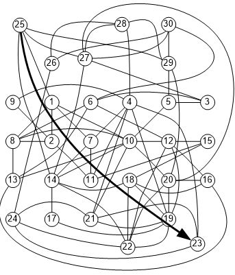

## Αναζήτηση Πληροφορίας

- Το Web είναι τεράστια πηγή πληροφορίας και δεδομένων - Πως μπορεί κανείς να ψάξει αυτή την «αποθήκη» για τη συγκεκριμένη πληροφορία που χρειάζεται;
- Xρησιμοποιoύνται οι **Μηχανές Αναζήτησης** (Search Engines) π.χ. Google, Bing, Yahoo, ASK.
- Αναζητήσεις με λέξεις κλειδιά (keywords) και Boolean λογική (ή, και)
- Επιστροφή αποτελεσμάτων (σελίδες που περιέχουν τα keywords) με συνδέσμους προς τις αρχικές θέσεις των εγγράφων.
- Οι βάσεις δεδομένων των μηχανών αναζήτησης είναι κτισμένες με αυτοματοποιημένα bots or spiders - λογισμικό που ψαρεύει στο Web διαβάζοντας και ανακτώντας την πληροφορία που χρειάζεται να προσθέσουν στη βάση δεδομένων τους. Τα αποτελέσματα ποικίλουν ανάλογα με τη μηχανή αναζήτησης.
- Αντίστοιχα bots χρησιμοποιούν και οι spammers για να «ψαρεύουν» email διευθύνσεις
- Κάποιες μετα-μηχανές αναζήτησης (π.χ. MetaCrawler) κάνουν παράλληλες αναζητήσεις χρησιμοποιώντας διαφορετικές μηχανές αναζήτησης.

## Τι κάνει ένας Πελάτης (Web client)

- Αφού συνδεθεί, ο χρήστης προσπελαύνει το Web μέσω λογισμικού που λέγεται browser (π.χ. FireFox, Chrome ή Edge/IE).
- Οι browsers εντοπίζουν και εμφανίζουν πληροφορία από το Web.
- Η επικοινωνία γίνεται δια μιας συμφωνημένης γλώσσας μεταφοράς ή πρωτοκόλλου: HTTP (HyperText Transfer Protocol).
- Ο χρήστης ζητάει μια ιστοσελίδα μέσω του browser ο οποίος το κοινοποιεί στον εξυπηρετητή.
- Ο browser περιμένει να μεταφερθεί η ιστοσελίδα, τυπικά ένα αρχείο κειμένου που περιέχει πληροφορίες σε HTML.
- Τα περίπλοκα γραφικά και η μορφοποίηση που βρίσκει κανείς στις ιστοσελίδες είναι αποτέλεσμα από τον client (browser) που αποδίδει την σελίδα στη μορφοποίηση που ήταν καθορισμένη στο αρχείο.
- Οι εικόνες και γραφικά δεν αποτελούν μέρος μιας HTML σελίδας αλλά αποστέλλονται ξεχωριστά (απλά ο browser διαβάζει την HTML σελίδα και εμφανίζει τα γραφικά βάσει των οδηγιών που περιλαμβάνονται στην HTML).

## Τι κάνει ένας εξυπηρετητής (Web server)

- Η δουλειά του server είναι πιο εύκολη.
- Ο server είναι λογισμικό (π.χ. Apache Server ή Microsoft Internet Information Server) που τρέχει σ’ έναν υπολογιστή και αποκρίνεται στις αιτήσεις του client για ιστοσελίδες
- Οι ιστοσελίδες υπάρχουν στο τοπικό του σύστημα αρχείων.
- Ο server ανακτά και διαβιβάζει τα αρχεία στον client.
- Τοπικοί εξυπηρετητές (localhosts) Apache:
  - XAMPP, UsbWebServer

## Πλοήγηση στο Web

- Για να προσπελάσουμε μια ιστοσελίδα, πρέπει να καθοριστεί στον browser η ακριβής της διεύθυνση, πληκτρολογώντας την, ή κάνοντας κλικ σ’ ένα σύνδεσμο.
- Αυτή η διεύθυνση είναι o παγκόσμιος εντοπιστής πόρων (Universal Resource Locator ή URL).
- Η URL περιέχει όλη την αναγκαία πληροφορία για τη μονοσήμαντη ταυτοποίηση ενός συγκεκριμένου αρχείου στον κόσμο.

## IP Διευθύνσεις στο Διαδίκτυο

Κάθε IP διεύθυνση αποτελείται από 4 bytes. Για να είναι ευανάγνωστη γράφεται σε δεκαδική μορφή με το δεκαδικό σημείο να διαχωρίζει τα bytes (dotted-decimal notation) όπως δείχνει το σχήμα:

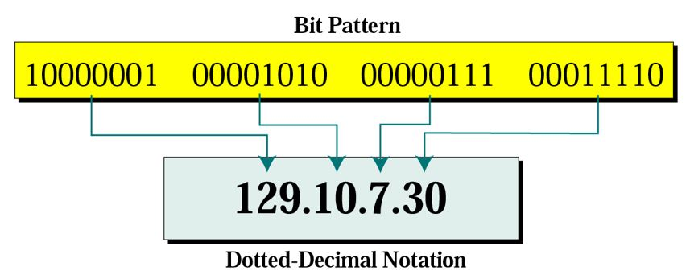

## Διευθύνσεις - Ονόματα Χώρου

- Οι Η/Υ έχουν ένα μοναδικό (ευμνημόνευτο από ανθρώπους) όνομα στο Διαδίκτυο (που αντιστοιχίζεται στην IP διεύθυνσή του)
  - sapfo.lesvos.aegean.gr (αντιστοιχεί στην IP διεύθυνση 195.251.128.3)
- Το πρώτο τμήμα δηλώνει έναν ειδικό (server) Η/Υ (sapfo).
- Το υπόλοιπο είναι το όνομα χώρου (domain name), που δηλώνει τον οργανισμό (lesvos.aegean.gr).
- Το τελευταίο τμήμα (πρόσφυμα, suffix) κάθε ονόματος χώρου συνήθως υποδηλώνει τον τύπο του οργανισμού ή τη χώρα (π.χ. gr, edu, com).

### Ονόματα Χώρου

Για παράδειγμα,

- edu (εκπαιδευτικό ίδρυμα)
- com (εμπορική επιχείρηση)
- org (μη κερδοσκοπική επιχείρηση)
- net (διαδικτυακός οργανισμός)

Το πρόσφυμα ως δηλωτικό της χώρας:

- uk (Ενωμένο Βασίλειο)
- au (Αυστραλία)
- ca (Καναδάς)
- se (Σουηδία)
- gr (Ελλάδα)

Νέες κατηγορίες προσφυμάτων είναι υπό θεώρηση.

## Domain Name System (DNS)

## Ο τρόπος οργάνωσης Uniform Resource Locator (URL)

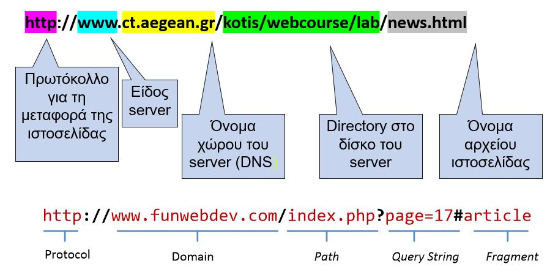

## URLs και Συστήματα Αρχείων

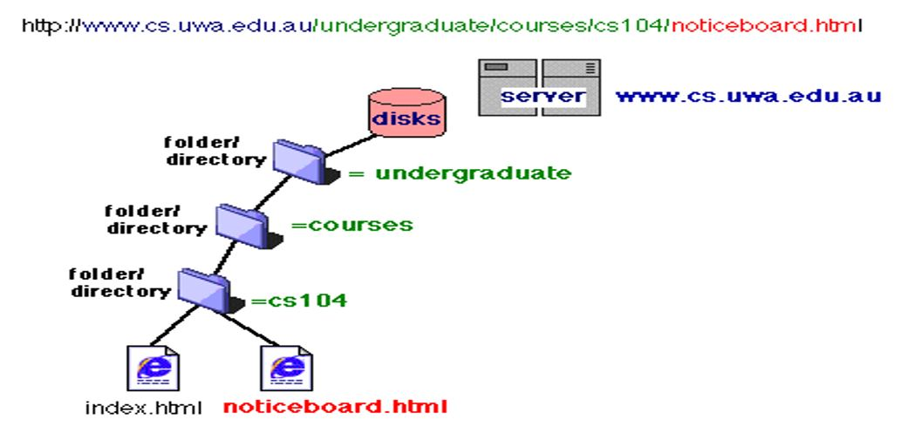

## Τόπος (site) – Ιστότοπος (Web site)

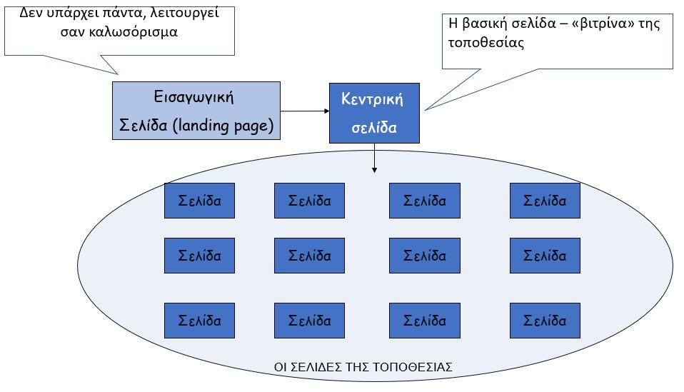

## Web Browser (Φυλλομετρητής)

Web browsers:

- Microsoft Internet Explorer/Edge
- Google Chrome
- Mozilla FireFox
- Safari

Βασικές λειτουργίες ενός browser:

- Στέλνει αιτήματα για αποστολή πληροφοριών σε εξυπηρέτες ιστού (web servers).
- Λαμβάνει τις πληροφορίες που αποστέλλει ο web server και σχεδιάζει την ιστοσελίδα.
- Παρέχει τη δυνατότητα στους χρήστες να αποθηκεύσουν (ή/και να εκτυπώσουν) στον Η/Υ τους τις πληροφορίες που λαμβάνουν.

- Παρέχει στους χρήστες τη δυνατότητα να κρατούν καταλόγους διευθύνσεων ώστε να μπορούν να τις επισκεφτούν ξανά (bookmarks / favorites).
- Κρατάει τη σειρά των συνδέσεων που έκανε ο χρήστης (χρήση back / next).
- Τονίζει τα σημεία σύνδεσης (hyperlinks):
  - Με διαφορετικό χρώμα
  - Αλλαγή δείκτη ποντικιού
  - Χρήση ιδιαίτερων γραφικών
  - Σημειώνει τους συνδέσμους για σελίδες που έχει ήδη επισκεφτεί ο χρήστης.

## Εξυπηρέτες παγκόσμιου ιστού (Web servers)

- Οι web servers λειτουργούν ως χώροι αποθήκευσης ιστοσελίδων. Αποτελούνται από:
  - Υλικό
  - Λειτουργικό σύστημα (Windows, Linux)
  - Λογισμικό Web server: Apache, IIS (τρέχει σε Windows)
- Στον ίδιο Η/Υ όπου τρέχει ο web server μπορούν να τρέχουν κι άλλοι servers (services).
- Οι web servers «ακούνε» σε μία συγκεκριμένη πόρτα (port 80) περιμένοντας αιτήσεις από clients (browsers).

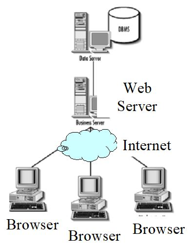

## Μοντέλο Client-Server στο Web

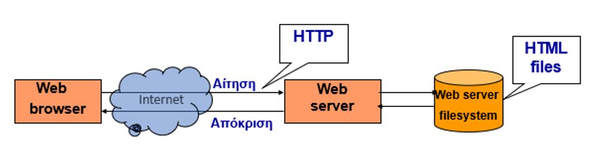

## «Συνομιλία» web client (browser) – web server

Τι συμβαίνει από τη στιγμή που πληκτρολογήσουμε τη διεύθυνση μιας τοποθεσίας:

- O browser απευθύνεται στον DNS name server που εξετάζοντας τη URL εντοπίζει την IP διεύθυνση του web server στον οποίο απευθύνεται η αίτηση.
- Ο browser στέλνει το αίτημα για αποστολή της ιστοσελίδας στον web server.
- Το αίτημα φτάνει στον web server που αναζητά και ανακτά την αιτούμενη σελίδα από τον τοπικό του δίσκο.
- Η ιστοσελίδα αποστέλλεται (μέσω HTTP).

Τι συμβαίνει από τη στιγμή που πληκτρολογήσουμε τη διεύθυνση μιας τοποθεσίας (συνέχεια):

- Ο browser λαμβάνει την ιστοσελίδα (HTML αρχείο), διαβάζει τις οδηγίες του HTML κώδικα και σχεδιάζει το περιεχόμενο αντίστοιχα.
- Αν η ιστοσελίδα περιέχει φωτογραφίες, αυτές στέλνονται ως ξεχωριστά αρχεία από τον web server στον browser.
- Αν ο HTML κώδικας έχει και ενσωματωμένο κώδικα σεναρίου (γραμμένο σε κάποια script γλώσσα, π.χ. JavaScript), αυτός εκτελείται από τον browser.

## HTTP

- Το πρωτόκολλο που χρησιμοποιείται στο WWW.
- Καθορίζει τη μορφοποίηση των μηνυμάτων (πακέτων) κατά τη μετάδοσή τους και τις ενέργειες που πρέπει να ακολουθήσουν οι web servers και οι web clients (browsers) ώστε να ανταποκριθούν στις διάφορες εντολές.
- π.χ., όταν εισάγουμε μια URL σε έναν browser, ουσιαστικά στέλνεται μια εντολή μέσω HTTP σε ένα απομακρυσμένο Web server κατευθύνοντάς τον να ανακτήσει και να αποστείλει μια συγκεκριμένη ιστοσελίδα (HTML αρχείο).
- To HTTP είναι «αμνήμων» (stateless): για την ολοκλήρωση μιας αποστολής (π.χ. ιστοσελίδα με κείμενο και εικόνες) απαιτούνται πολλαπλές συνδέσεις (αιτήσεις/αποκρίσεις). Έτσι αυξάνεται η κλιμάκωση (scalability) καθώς εξυπηρετούνται ταυτόχρονα πολλοί clients αλλά μειώνεται η ταχύτητα.

## HTML5

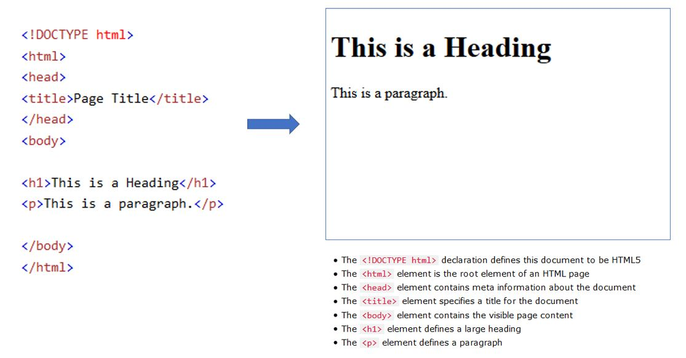

## JavaScript

…the programming language of HTML and the Web!

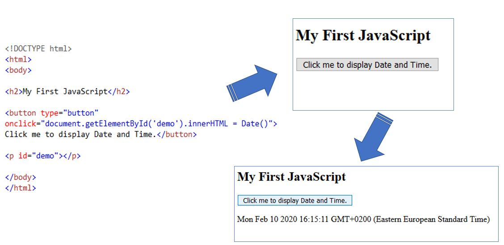

## Συστήματα Διαχείρισης Περιεχομένου (ΣΔΠ, Content Management Systems, CMS)

- Διαδικτυακές εφαρμογές που επιτρέπουν την διαχείριση του περιεχομένου ενός δικτυακού τόπου (digital content).
- Υποστηρίζουν τον διαχωρισμό του **‘περιεχομένου’** (content) από την **‘παρουσίαση’** (presentation).
- **Διαχείριση**: Δημιουργία, επεξεργασία, δημοσίευση...
- **Περιβάλλον διαχείρισης**: Multi-user (πολλοί χρήστες), Collaborative (συνεργατικό), Web-based, ...
- **Χρήστες**: με διαφορετικά δικαιώματα, ρόλους π.χ. διαχειριστής, συγγραφέας
- Συνήθως το “content” αφορά ιστότοπο/ιστοσελίδα, blog, web app &rarr;  **Web content management system**.
- **“Web content”**: κείμενο, γραφικά, φωτογραφίες, βίντεο, ήχος, χάρτες, κώδικα εφαρμογών...
- Δύο βασικά συστατικά/components:
  - Εφαρμογή διαχείρισης περιεχομένου - content management application (**CMA**): **front-end user interface** που επιτρέπει στον χρήση (ακόμα και με περιορισμένη εξειδίκευση) να προσθέτει, τροποποιεί, αφαιρεί περιεχόμενο από ένα ιστότοπο, χωρίς την παρέμβαση ενός διαχειριστή (webmaster)
  - Εφαρμογή  παράδοσης περιεχομένου - content delivery application (**CDA**): **back-end user interface** που επιτρέπει την μεταγλώττιση (compilation) του περιεχομένου και την ενημέρωση του ιστότοπου
- **Ενιαίο περιβάλλον διαχείρισης** του περιεχομένου και της εμφάνισης μέσω ενός κεντρικού πίνακα ελέγχου
- **Μεγάλη συλλογή πρόσθετων** (plugins, addons, extentions) που μπορούν εγκατασταθούν και να αλλάξουν την λειτουργικότητα τους
- Τα γνωστότερα Συστήματα Διαχείρισης Περιεχομένου είναι το WordPress, το Joomla και το Drupal τα οποία είναι **δωρεάν και ανοιχτού λογισμικού εφαρμογές**.
