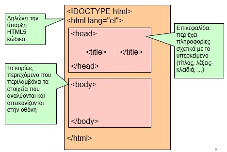
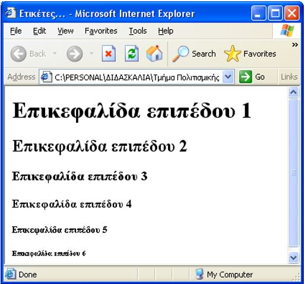
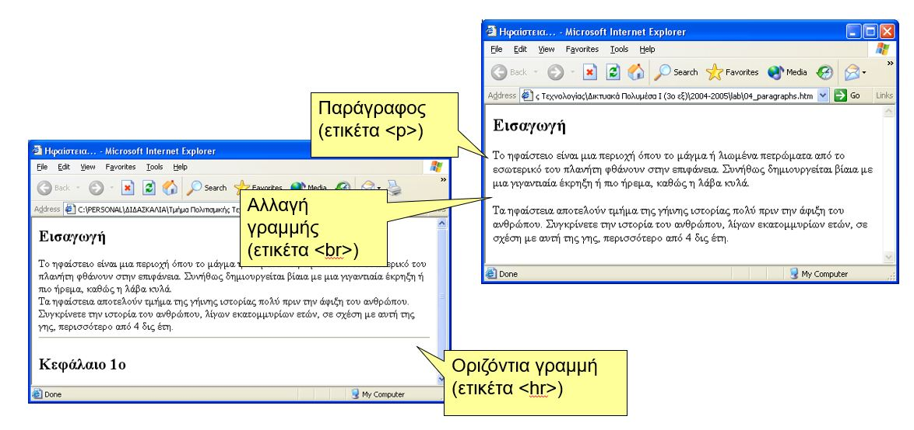

[](https://hits.seeyoufarm.com)

# Εισαγωγή στη HTML

## Markup Languages

- Ο όρος **markup** αναφέρεται σε ένα σύνολο από **ενδείξεις / παρατηρήσεις** που αναφέρονται και περιγράφουν τα δεδομένα ενός κειμένου.
- Πρόκειται για **οδηγίες** στο τρόπο με τον οποίο πρέπει να ερμηνευτούν τα περιεχόμενα του κειμένου.
- Μια συλλογή τέτοιων ενδείξεων, που ακολουθούν καθορισμένο συντακτικό και γραμματική, μπορεί να θεωρηθεί **γλώσσα**.
- Μία Markup γλώσσα **προσδίδει πληροφορία** για τα περιεχόμενα ενός κειμένου  .
- Οι Markup Languages είναι μια μέθοδος για να δημιουργούμε μεταδεδομένα (**metadata**).
- **1969**: GML (Generalized Markup Language – Γενικευμένη Γλώσσα Σήμανσης), η πρώτη «σύγχρονη» markup γλώσσα από την ΙΒΜ.
- **1986**: SGML (Standard Generalized Markup Language – Πρότυπη Γενικευμένη Γλώσσα Σήμανσης), ISO standard για αποθήκευση και ανταλλαγή δεδομένων.
- **1991**: HTML (HyperΤext Markup Language – Γλώσσα Σήμανσης Υπερκειμένου),  αποτέλεσε μια εφαρμογή της  SGML.
- **~2000**: Η ταχύτατη ανάπτυξη του Web και οι περιορισμένες  δυνατότητες της HTML γέννησαν την XML (Extensible Markup Language – Επεκτάσιμη Γλώσσα Σήμανσης.
- **~2004**: Σημασιολογικός Ιστός (Web 3.0), μια επέκταση του σημερινού Ιστού, που φέρει δομή στο περιεχόμενο των ιστοσελίδων, βασίζεται σε τεχνολογίες που ήδη υπάρχουν (URI και XML) αλλά και σε πιο νέες τεχνολογίες (RDF, RDFS, OWL).

## HTML και CSS

- Τι είναι HTML και CSS;
  - Διαχωρισμός περιεχομένου/μορφοποίησης
  - Πότε χρησιμοποιούμε το ένα και πότε το άλλο;
- HTML: Περιγράφει περιεχόμενο
  - HyperText Markup Language
- CSS: Περιγράφει μορφοποίηση
  - Cascading Style Sheets
- Σωστός διαχωρισμός από την αρχή πάντα

## HyperText Markup Language: HTML

- Γλώσσα κειμένου που χρησιμοποιείται για να δημιουργηθούν σελίδες ιστού.
- HyperText (υπερ-κείμενο): δίνει στο χρήστη τη δυνατότητα ανάγνωσης και κίνησης μέσα σε κείμενο και άλλες μορφές οπτικής πληροφορίας, ακολουθώντας μια σειρά από συνδέσμους.
- Σχεδιάστηκε για να καθορίσει τη λογική οργάνωση ενός αρχείου κειμένου που προορίζεται να «δημοσιευτεί» στον παγκόσμιο ιστό.
- Ουσιαστικά πρόκειται για μια γλώσσα οδηγιών που καθοδηγεί διαφορετικά προγράμματα ανάγνωσης ιστοσελίδων (φυλλομετρητές – browsers) να «μεταφράσουν» τις οδηγίες και να σχεδιάσουν τα αποτελέσματα (πληροφορία) στη σελίδα του χρήστη.
- Ένα HTML αρχείο είναι ένα απλό αρχείο κειμένου (text file). Έτσι, δεν χρειάζεται ένα ειδικό επεξεργαστή κειμένου. Αρκεί ένας απλός επεξεργαστής κειμένου όπως είναι το NotePad++.
- Υπάρχουν ωστόσο και ειδικά προγράμματα για τη γρήγορη και εύκολη συγγραφή HTML κώδικα (web authoring tools), όπως το Adobe Dreamweaver (απαιτούν άδεια!) και άλλα τα οποία διατίθενται δωρεάν (π.χ. BlueGriffon).
- Η HTML δεν αποτελεί έναν "Παίρνεις Αυτό Που Βλέπεις" (What You See Is What You Get, WYSIWYG) επεξεργαστή κειμένου όπως το MS Word. Δηλαδή, ο HTML κώδικας δεν απεικονίζεται αυτούσιος όταν το HTML αρχείο ανοίγεται από έναν browser.
- Σε μια ιστοσελίδα χρησιμοποιούνται διαφορετικοί τρόποι αναπαράστασης πληροφορίας: κείμενο, εικόνες και σύνδεσμοι, ...
- Η HTML δεν δημιουργεί αυτά τα αντικείμενα, αλλά λέει στον browser που και πώς να τοποθετήσει τα αντικείμενα αυτά στην επιφάνεια της σελίδας.
- Η HTML είναι επεκτάσιμη (extensible) γλώσσα, δηλαδή μπορούν να προστεθούν σε αυτή νέες ιδιότητες και λειτουργίες, χωρίς να ακυρώνονται υπερκείμενα ανεπτυγμένα σε παλαιότερες εκδόσεις της.
- Τα αρχεία HTML έχουν συνήθως κατάληξη `.html` ή `.htm` (htm για servers που δεν υποστηρίζουν καταλήξεις με 4 χαρακτήρες).
- Συνήθως η κεντρική σελίδα: `index.html` ή `default.html`.
- Ο έλεγχος ενός αρχείου HTML μπορεί να γίνει «τοπικά» με τη χρήση browser και χωρίς να είναι αναγκαία η εγκατάσταση του αρχείου σε κάποιο διακομιστή (Web Server).

## Βασικά συστατικά HTML

Η σήμανση (markup) της HTML αποτελείται από μερικά βασικά συστατικά, τα οποία είναι:

- η δήλωση του τύπου εγγράφου
- οι (βασισμένοι σε χαρακτήρες) τύποι δεδομένων
- οι αναφορές χαρακτήρων
- οι αναφορές οντοτήτων
- τα στοιχεία (attributes)
- οι ιδιότητές τους

Τα στοιχεία HTML αποτελούνται, στην πιο γενική τους μορφή, από τρία συστατικά:

- ένα ζεύγος από ετικέτες (tags), οι οποίες αφορούν ετικέτες έναρξης (start tags) και ετικέτες λήξης (end tags).
- μερικές ιδιότητες μέσα στην ετικέτα έναρξης.
- και το κείμενο ή το γραφικό περιεχόμενο μεταξύ των ετικετών, το οποίο μπορεί να εμφωλεύει μέσα του και άλλα στοιχεία.

## Βασική δομή ενός HTML εγγράφου



- Το παράδειγμα ξεκινάει με τη δήλωση τύπου εγγράφου (DOCTYPE - Document Type Declaration), το οποίο στον παραπάνω κώδικα είναι για την HTML5
- Στη συνέχεια, ακολουθεί το στοιχείο `<html>`, το οποίο ορίζει ολόκληρο το έγγραφο. Με αυτήν την ετικέτα, ο περιηγητής “καταλαβαίνει” ότι ξεκινάει ένα HTML έγγραφο
- Η γλώσσα του εγγράφου συνίσταται να δηλώνεται στην ιδιότητα “lang” του στοιχείου `<html>`
- Τα πρώτα δύο γράμματα προσδιορίζουν τη γλώσσα (εδώ “el”), ενώ τα επόμενα δύο τη διάλεκτο, π.χ., για αγγλικά ΗΠΑ (“en-US”)
- Η δήλωση της γλώσσας είναι σημαντική για εφαρμογές προσβασιμότητας (screen readers), καθώς και μηχανές αναζήτησης
- Το στοιχείο `<head>` είναι “container” για HTML για μεταδεδομένα (metadata), τα οποία αποτελούν δεδομένα σχετικά με το HTML έγγραφο
- Τα **metadata** δεν εμφανίζονται στην ιστοσελίδα
- Ορίζουν τον τίτλο του εγγράφου, τα στυλ (που θα δούμε στη συνέχεια), υπερσυνδέσμους, scripts, κ.α.
- Οι αντίστοιχες ετικέτες που περιγράφουν metadata είναι οι ακόλουθες: `<title>`, `<style>`, `<meta>`, `<link>`, `<script>`, and `<base>`
- Στο συγκεκριμένο παράδειγμα χρησιμοποιήθηκε επίσης η ετικέτα `<title>`
- Το στοιχείο αυτό είναι απαραίτητο για κάθε HTML έγγραφο, καθώς:
  - ορίζει έναν τίτλο για την ιστοσελίδα στον περιηγητή και
  - εμφανίζει τον τίτλο της ιστοσελίδας στα αποτελέσματα των μηχανών αναζήτησης
- Το στοιχείο `<body>` ορίζει το κυρίως “σώμα” του εγγράφου
- Έχει ετικέτα έναρξης `<body>` και ετικέτα λήξης `</body>`
- Σε αυτό περιέχεται ό,τι θέλουμε να εμφανίζεται στην ιστοσελίδα

## Τι είναι οι ετικέτες (tags) της HTML

Οδηγίες προς τον browser σχετικά με το πως θα μορφοποιήσει ένα σώμα κειμένου. Η γενική μορφή μιας HTML ετικέτας είναι:

```html
<tag_name>Σώμα κειμένου</tag_name>
```

Κάθε δομικό συστατικό (στοιχείο) ενός HTML εγγράφου αποτελείται από 3 μέρη:

- Την ετικέτα έναρξης (start tag), <…>
- Το περιεχόμενό του
- Την ετικέτα λήξης (end tag), </…>

Π.χ. `<TITLE> Hello World </TITLE>`
Μπορούν να υπάρξουν και «άδεια στοιχεία» (δεν περιλαμβάνουν περιεχόμενο ούτε έχουν ετικέτα λήξης, π.χ. `<br>`.

H HTML δεν κάνει διάκριση μεταξύ ετικετών γραμμένων με μικρά ή κεφαλαία γράμματα, π.χ. ο κώδικας `<title>Κεφάλαιο 1ο</title>` ταυτόσημος με τον `<TITLE>Κεφάλαιο 1ο</TITLE>`.

## Προσθήκη σχολίων στην HTML

- Το ζεύγος ετικετών `<!-- … -->` χρησιμοποιείται στην HTML για να ορίσει σχόλια στον πηγαίο κώδικα.
- Τα σχόλια δεν εμφανίζονται από τον περιηγητή ιστοσελίδων.
- Είναι χρήσιμα για την επεξήγηση του κώδικα, ώστε να είναι ευκολότερο να τον αλλάξουμε κάποια άλλη στιγμή (που πιθανά δε θα θυμόμαστε πλέον τι έχουμε γράψει, ιδίως αν έχει περάσει καιρός), ή κάποιος άλλος που τον βλέπει για πρώτη φορά.
- Παράδειγμα: `<!– αυτό είναι ένα σχόλιο-->`.

## Ετικέτες επικεφαλίδων

- Για να δημιουργήσουμε μια επικεφαλίδα N-οστού επιπέδου γράφουμε:
  - `<hN>Κείμενο Τίτλου</hN>`.
- π.χ., ο κώδικας `<h1>Κεφάλαιο 1ο</h1>` θα δημιουργήσει μια επικεφαλίδα **επιπέδου 1** με κείμενο «Κεφάλαιο 1ο»
- Όσο μικρότερο το **Ν**, τόσο μεγαλύτερη θα εμφανίζεται η ετικέτα
- Ο κώδικας της HTML έχει σχεδιαστεί για να παίρνουν οι επικεφαλίδες τους 6 τύπους (h1 - h6)!



```html
<!DOCTYPE HTML>
<HTML>
  <HEAD>
  <!-- Το head περιέχει πληροφορίες που αφορούν το αρχείο και δεν εμφανίζονται στην οθόνη. -->
    <TITLE>Ετικέτες...</TITLE>
  </HEAD>
  <BODY>
  <!-- Γραμμένο από τον ...., στις ......  -->
    <h1>Επικεφαλίδα επιπέδου 1</h1>
    <h2>Επικεφαλίδα επιπέδου 2</h2>
    <h3>Επικεφαλίδα επιπέδου 3</h3>
    <h4>Επικεφαλίδα επιπέδου 4</h4>
    <h5>Επικεφαλίδα επιπέδου 5</h5>
    <h6>Επικεφαλίδα επιπέδου 6</h6>
  </BODY>
</HTML>
```

## Παράγραφοι, Αλλαγή γραμμής, οριζόντιες γραμμές

- Ο Web browser αγνοεί όλα τα κενά από το πάτημα του ENTER μέσα στο κείμενο. Για αυτό το λόγο, η HTML έχει ετικέτα για την τοποθέτηση μιας παραγράφου. Αυτή η ετικέτα λέει στον browser να αφήσει μία κενή γραμμή. Ο κώδικας είναι ο ακόλουθος: `<p>`.
- Επίσης, πριν και μετά την `<h>` ετικέτα, δεν τοποθετούμε την `<p>` ετικέτα, αφού αλλάζει από μόνη της παράγραφο.
- H ετικέτα `<br>` (επίσης δεν χρειάζεται ετικέτα τέλους) απλά αλλάζει γραμμή (χωρίς να αφήνει κάποιο κενό διάστημα μεταξύ των παραγράφων όπως κάνει η ετικέτα `<p>`.
- Τέλος, η ετικέτα `<hr>` εισάγει μια οριζόντια γραμμή στο έγγραφο.
- Σημείωση: μετά από μια επικεφαλίδα (`<hN>`) δεν αλλάζουμε παράγραφο με την ετικέτα `<p>` (τα headers αλλάζουν παράγραφο αυτόματα).



## Ετικέτες στυλ

**Bolding:**

- `<strong>text you want bold (strongly emphasized) </strong>`
- `<b> The bold tag should not be used. </b>`

**Italicizing:**

- `<em>text you want in italics (emphasized) </em>`
- `<i> The italics tag should not be used. </i>`

Πως θα μορφοποιήσω ένα κείμενο ως **bold + italic**;

- `<strong><i>This is Bold and underlined</i></strong>`
