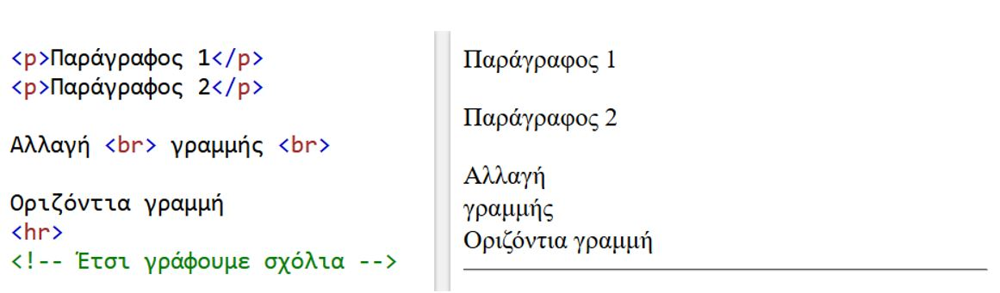
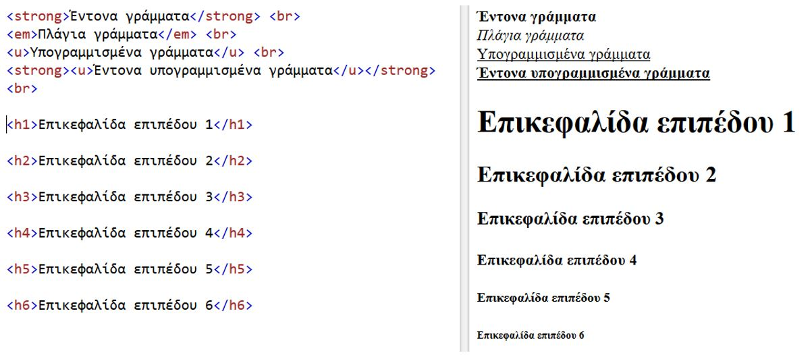
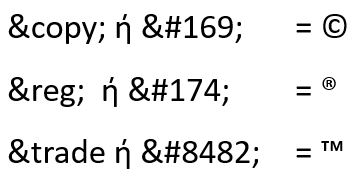
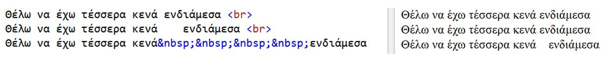
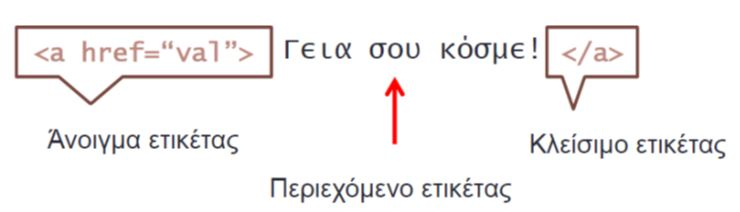
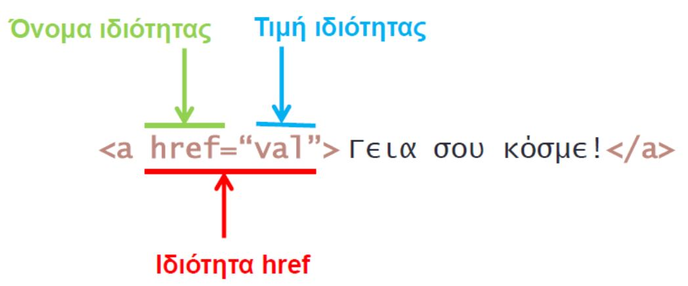
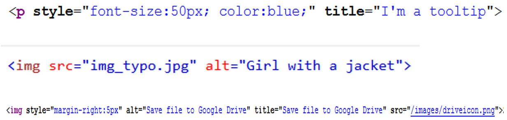
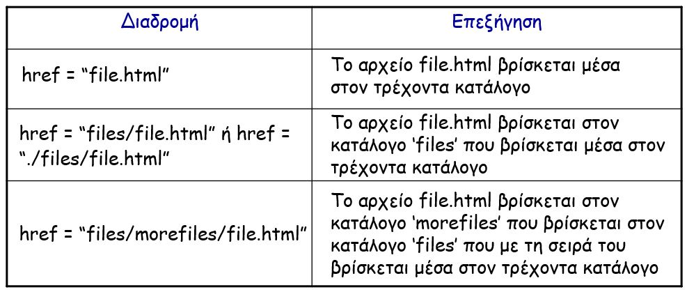
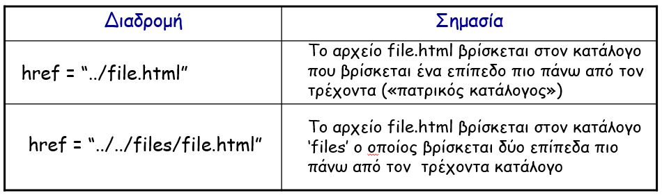

[](https://hits.seeyoufarm.com)

# Ειδικοί χαρακτήρες, Ιδιότητες ετικετών, Σύνδεσμοι, Εικόνες

## Επανάληψη - Βασική δομή HTML εγγράφου

```html
<!DOCTYPE html> <!--Δήλωση ότι πρόκειται για έγγραφο HTML 5--> 
<html lang=“el”>
    <head>
        <title>Εδώ γράφεται ο τίτλος της ιστοσελίδας</title> 
        <meta charset="UTF-8">       
    </head>
    <body>
        Εδώ γράφεται το κύριο μέρος ιστοσελίδας.....
    </body>
</html>
```

## Επανάληψη - Παράγραφοι, Αλλαγή γραμμής, οριζόντιες γραμμές, σχόλια



## Επανάληψη – Ετικέτες στυλ



## Ειδικοί χαρακτήρες

Επειδή οι ιστοσελίδες δημιουργούνται με απλό κείμενο σε  ASCII (American Standard Code for Information Interchange),  οι χαρακτήρες στον κώδικα περιορίζονται στους χαρακτήρες του πληκτρολογίου. Για να εμφανίσουμε ειδικούς χαρακτήρες σε μια ιστοσελίδα, όπως π.χ. © πρέπει να χρησιμοποιήσουμε ειδικούς κωδικούς.

Παραδείγματα:



Ειδικό χαρακτήρα βάζουμε και για το κενό (&nbsp ή &#160) όταν πρόκειται για παραπάνω από ένα κενά. Δηλαδή:



Όλοι οι ειδικοί χαρακτήρες, με τους αντίστοιχους κωδικούς τους, που χρησιμοποιεί η HTML5 είναι διαθέσιμοι στην ιστοσελίδα [Character Entity Reference Chart](https://dev.w3.org/html5/html-author/charref).

## Ιδιότητες ετικετών

Εμφανίζονται μετά το όνομα της ετικέτας.



- Κάθε ιδιότητα έχει όνομα και τιμή.
- Το όνομα και η τιμή διαχωρίζονται με = και η τιμή περιλαμβάνεται σε “εισαγωγικά”.
- Οι ιδιότητες διαχωρίζονται με κενό από το όνομα της ετικέτας και από τις άλλες ετικέτες.



## Πολλαπλές Ιδιότητες ετικετών



## Η ετικέτα <a> (anchor tag)

- Για τη δημιουργία συνδέσμου (link) προς μια ιστοσελίδα χρησιμοποιούμε το ζεύγος ετικετών `<a>` `</a>` (anchor tags, anchor: άγκυρα>).
- Η γενική σύνταξη είναι:
  - `<a href="URL">κείμενο που θα αποτελεί σύνδεσμο</a>`
    - **href** = Hypertext REFerence
    - **URL** = Uniform Resource Locator (μία διεύθυνση, π.χ. `http://www.aegean.gr/`)
- Παράδειγμα: `<a href="http://www.aegean.gr/welcome.html">Σελίδα καλωσορίσματος!</a>`.

## Σύνδεση τοπικών σελίδων με απόλυτες διαδρομές

- Τοπικές σελίδες: σελίδες που ανήκουν στο ίδιο web site, δηλ. είναι αποθηκευμένες στο ίδιο τοπικό σύστημα αρχείων (file system) ενός Web Server.
- Οι απόλυτες διαδρομές δείχνουν στη σελίδα προορισμού ξεκινώντας από το ανώτατο επίπεδο ιεραρχίας καταλόγων (root directory) και προχωρώντας προς τα κάτω, διασχίζοντας τους ενδιάμεσους καταλόγους.

Παραδείγματα:

```html
<a href="D:\Examples\chap5\books.html">Σύνδεσμος απόλυτης διαδρομής</a>
<a href=“C:\mywebpage.html">Σύνδεσμος απόλυτης διαδρομής</a>
```

## Σύνδεση τοπικών σελίδων με σχετικές διαδρομές

Οι σχετικές διαδρομές δείχνουν τη σελίδα την οποία θέλουμε να διασυνδέσουμε με την τρέχουσα, περιγράφοντας τη θέση της (τοποθεσία αποθήκευσης) σε σχέση με τη θέση της τρέχουσας σελίδας.





- Συμπέρασμα: Σχετικές ή Απόλυτες διαδρομές;
- Η χρήση απόλυτων διαδρομών φαίνεται η εύκολη λύση
- Oι απόλυτες διαδρομές **δεν είναι «μεταφέρσιμες»** (portable)
- Αν οι σελίδες μετακινηθούν σε άλλο δίσκο ή κατάλογο ή κάποιος κατάλογος μετονομαστεί, όλες οι συνδέσεις παύουν να ισχύουν. Επίσης, είναι δύσκολη η μεταφορά των αρχείων του web site στον web server όταν η κατασκευή του site τελειώσει και θελήσουμε να το «δημοσιεύσουμε».
